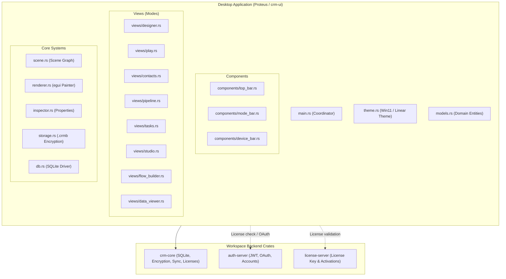
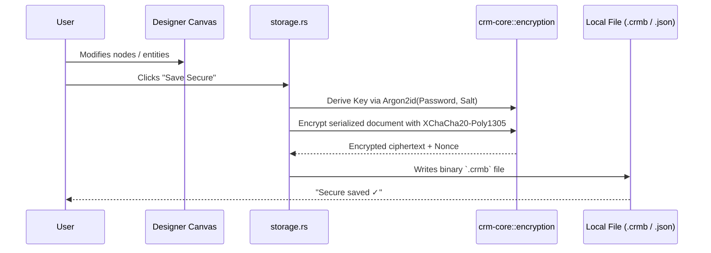

---
tags:
  - developer/architecture
aliases:
  - System Overview
  - Visual Architecture
---
# Architecture Overview

> Complete architectural blueprint for **Proteus (CRM Builder)**.
> Updated 2026-09-08 with the native Rust + egui desktop architecture and modular directory layout.

---

## 1. High-Level System Architecture



---

## 2. Directory Hierarchy & Code Organization

Each source file has a single responsibility and is constrained to **100–400 lines** to prevent monolithic sprawl:

```
project/crm-ui/src/
├── main.rs                 # App bootstrap, eframe update loop, coordinator (~450 lines)
├── theme.rs                # Windows 11 / Linear dark design system tokens & visuals
├── models.rs               # Domain types (Contact, Deal, Task, Viewport2D, Presets)
│
├── components/             # Reusable global panels
│   ├── mod.rs
│   ├── top_bar.rs          # Project name, Save/Load, Secure export, Grid toggle
│   ├── mode_bar.rs         # Top tab bar switching active modes
│   └── device_bar.rs       # Device frame toolbar (Desktop HD, Laptop, Tablet, Phone)
│
├── views/                  # Mode-specific views (Left, Central, Right panels)
│   ├── mod.rs
│   ├── contacts.rs         # Contacts list, detail card, notes timeline, edit modal
│   ├── pipeline.rs         # 7-stage Kanban board, deal movement, auto-task creation
│   ├── tasks.rs            # Overdue/Today/Upcoming sections, priority filtering
│   ├── studio.rs           # Vector layers, brush tool, shapes, text layers
│   ├── designer.rs         # Infinite canvas, 8-point handles, snapping, page tree
│   ├── play.rs             # Runtime runner (form field binding -> SQLite upsert)
│   ├── flow_builder.rs     # Automation graph (Triggers, Actions, DB operations)
│   ├── flow_legacy.rs      # Simple node canvas
│   └── data_viewer.rs      # Direct SQLite record browser & row editor modal
│
├── scene.rs                # Hierarchical Scene Graph & Serialization
├── renderer.rs             # Direct egui painter rendering engine
├── inspector.rs            # Property inspector for selected designer nodes
├── storage.rs              # Encrypted (.crmb) & JSON persistence
└── db.rs                   # Local SQLite records helper (EAV schema)
```

---

## 3. Storage & Encryption Flow



---

## 4. Module Rules & Architectural Invariants

1. **Flat State Machine (`ProteusApp`)**:
   - `ProteusApp` remains the single source of truth. No complicated multi-threaded state containers or redux-like indirection.
   - Views receive `&mut ProteusApp` and draw directly to egui panels.
2. **File Size Limit**:
   - No view or component file should exceed **400 lines**. When a view grows beyond this, extract subcomponents (e.g. modals or card renderers).
3. **Pure Native Offline-First**:
   - The app must boot and operate 100% offline without network calls. Cloud sync and licensing are strictly additive.

Related: [[../Company/Business Execution Roadmap|Business Roadmap]] | [[01 - Getting Started|Setup]] | [[08 - Database Schema|Database]]
