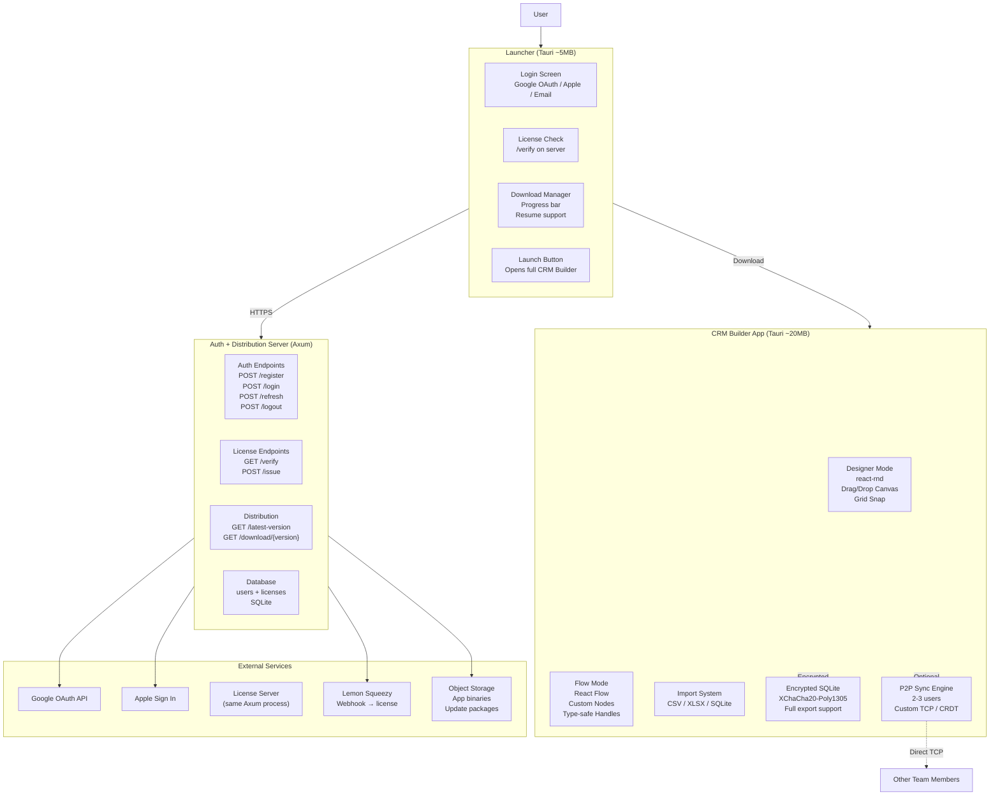
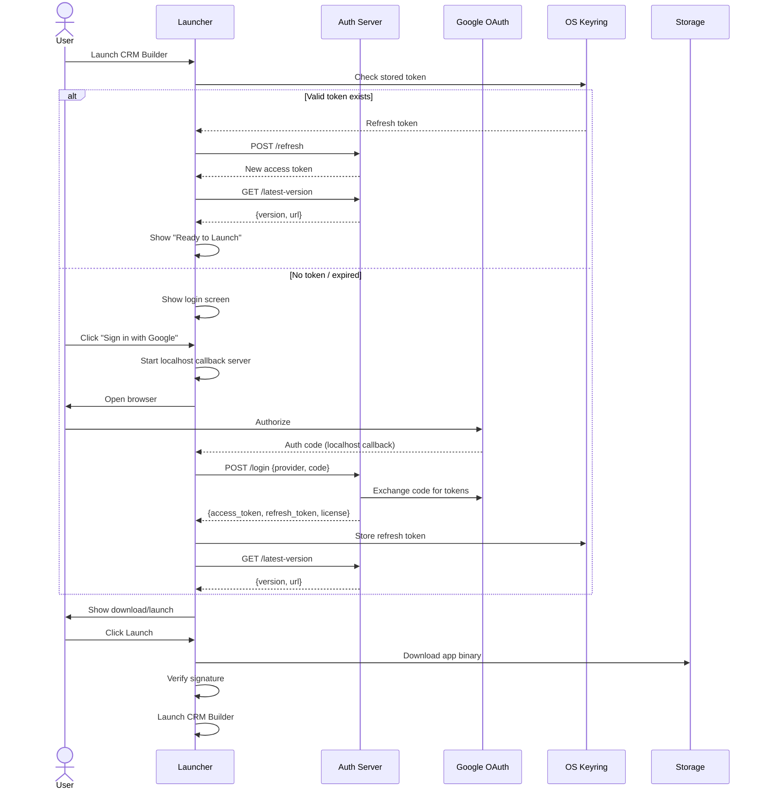
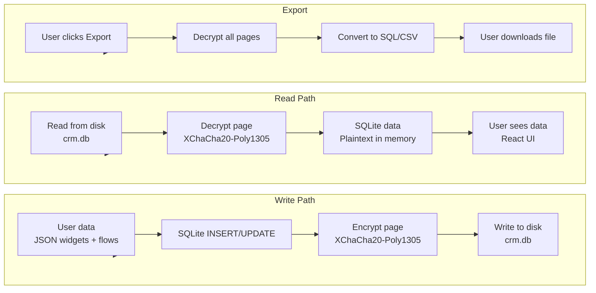
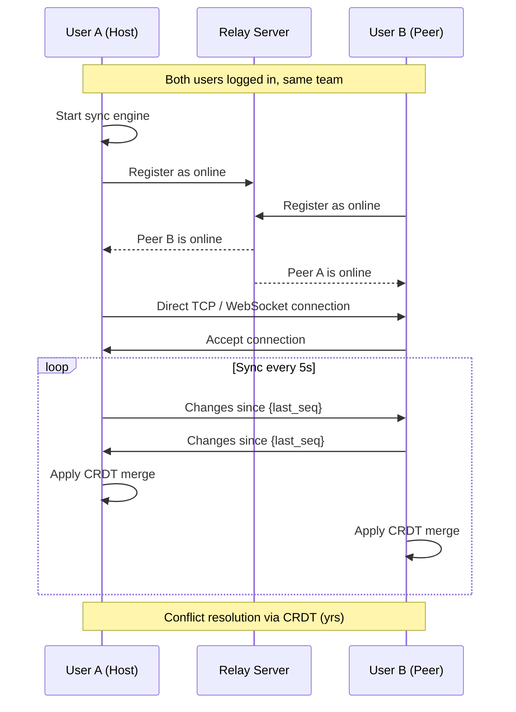
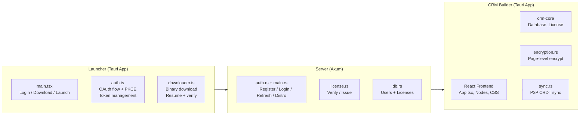
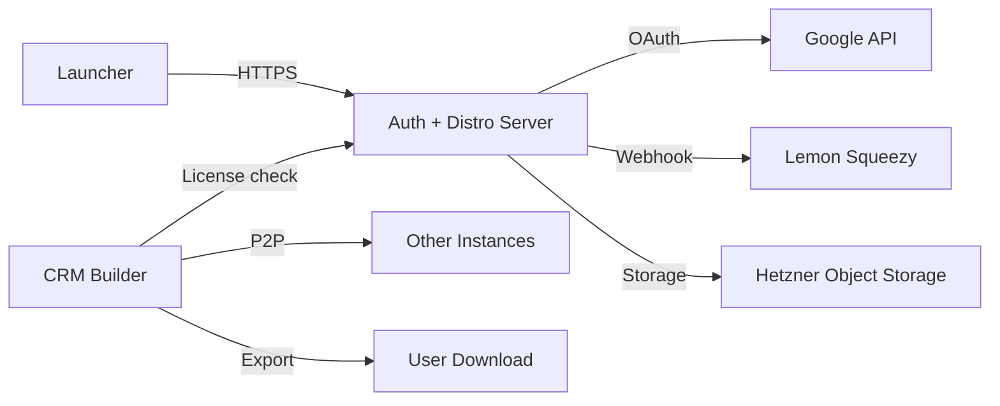

---
tags:
  - developer/architecture
aliases:
  - System Overview
  - Visual Architecture
---
# Architecture Overview

> Visual hub for the CRM Builder system. Updated 2026-07-04 with launcher model.

## System Architecture (Launcher Model)

## Auth Flow

## Data Encryption Flow

## P2P Sync (2-3 Users)

## Component Structure

## External Connections

Related: [[01 - Getting Started|Setup]] | [[10 - Foundation Architecture|Foundation]] | [[09 - Build & Deploy|Deploy]]
