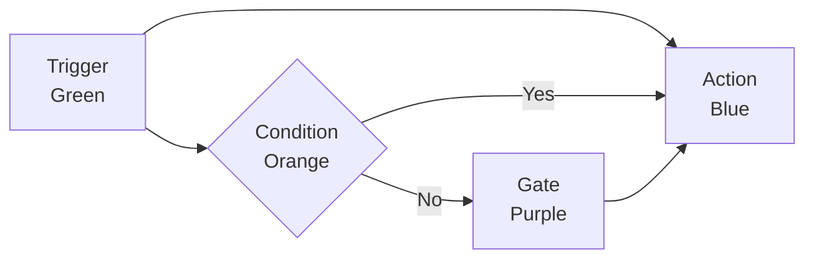

---
tags:
  - developer/nodes
---
# Nodes System

> Four custom React Flow nodes for visual business logic.

## Node Types

| Type | Color | Handles | Function |
|------|-------|---------|----------|
| Trigger | Green | 1 source | Entry point |
| Action | Blue | 1 target, 1 source | Execute |
| Condition | Orange | 1 target, 2 sources | If/else |
| Gate | Purple | 2 targets, 1 source | AND/OR |

## Handle Colors

- Green: trigger signal
- Blue: data object
- Orange: boolean
- Purple: combined

Related: [[02 - Architecture|Architecture]] | [[05 - Frontend|Frontend]]
