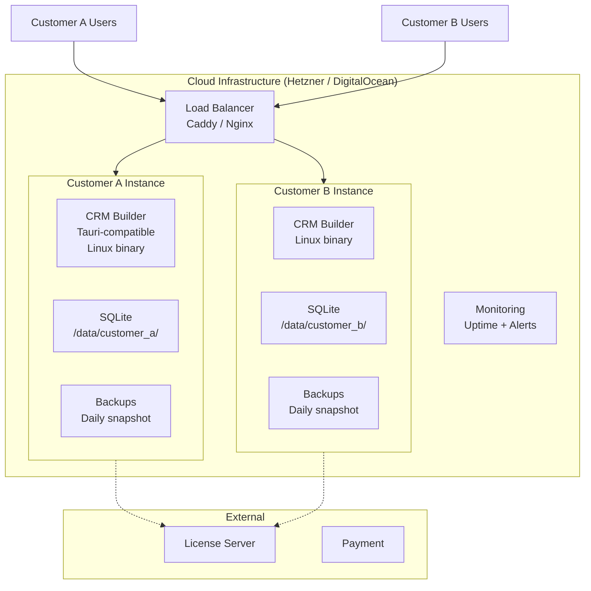
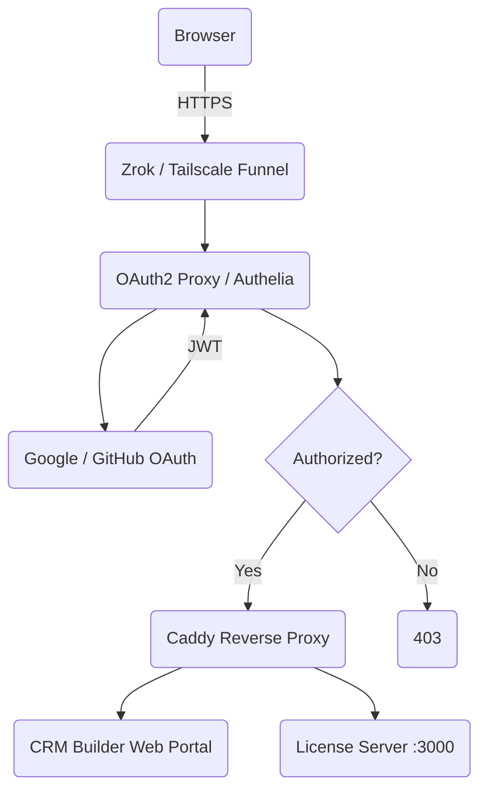

---
tags:
  - developer/deploy
---
# Build & Deploy

> Platform-specific installers via `cargo tauri build`.

## Build

| Command | Result |
|---------|--------|
| `cargo tauri dev` | Dev + HMR |
| `cargo tauri build` | Installer |
| `cargo build -p license-server` | License binary |

## Platform Installers

| Platform | Format |
|----------|--------|
| Windows | .msi / .exe |
| macOS | .dmg |
| Linux | .deb / .AppImage |

## Deployment Models

| Model | Who manages | Best for | Price |
|-------|-------------|----------|-------|
| **Self-hosted** | Customer | Tech-savvy, IT teams | EUR 0-28/mo (license only) |
| **Cloud-hosted** | We manage | Non-technical businesses | EUR 5-38/mo (license + hosting) |

### Cloud Hosting Architecture

For cloud-hosted customers, we run the app on a VPS with their license. Each customer gets an isolated instance.



Each customer instance:
- Runs as a systemd service under a dedicated Linux user
- Data stored in `/data/{customer_id}/` with isolated SQLite
- Daily encrypted backups to S3-compatible storage
- Automatic OS + app updates via cron
- Monitoring with Uptime Kuma or similar

### Self-Hosted Infrastructure



## Docker Deployment

Both servers have Dockerfiles at `auth-server/Dockerfile` and `license-server/Dockerfile`.

### docker-compose (development / single-VPS)

```bash
docker compose up -d
# Auth server on :3001, License server on :3000
```

### Environment Variables (auth-server)

Copy `auth-server/.env.example` and fill in:

| Variable | Required | Description |
|----------|----------|-------------|
| `JWT_SECRET` | Yes | Random 64-char string for JWT signing |
| `GOOGLE_CLIENT_ID` | No (until OAuth) | Google OAuth app client ID |
| `GOOGLE_CLIENT_SECRET` | No (until OAuth) | Google OAuth app secret |
| `ALLOWED_ORIGINS` | No | Comma-separated origins for CORS (default: all) |
| `RUST_LOG` | No | Log level (default: info) |

## Hetzner VPS Setup

### 1. Create CX22 or CX32 instance

```
Hetzner Cloud Console → Create Server
- Location: Nürnberg or Helsinki (EU data)
- OS: Ubuntu 24.04 LTS
- Type: CX22 (2 vCPU, 4 GB RAM) minimum
- Volume: 20 GB + 10 GB extra (for data)
```

### 2. Initial setup

```bash
# SSH in
ssh root@<vps-ip>

# Install Docker
apt update && apt install -y docker.io docker-compose-v2

# Create app user
useradd -m -s /bin/bash crm
```

### 3. Deploy servers

```bash
# Clone the server config (binary-only, no source on VPS)
mkdir -p /opt/crm
# SCP the docker-compose.yml and .env file
# Or use a deployment pipeline

cd /opt/crm
docker compose up -d
```

### 4. Configure firewall

```bash
ufw allow 22/tcp        # SSH
ufw allow 80/tcp        # HTTP (Caddy reverse proxy)
ufw allow 443/tcp       # HTTPS
ufw allow 3000/tcp      # License server API
ufw allow 3001/tcp      # Auth server API
ufw enable
```

### 5. Optional: Caddy reverse proxy

```
crm.example.com {
    reverse_proxy localhost:3001
}

license.crm.example.com {
    reverse_proxy localhost:3000
}
```

### DNS

Point `auth.crmbuilder.app` and `license.crmbuilder.app` to your VPS IP. Use `ALLOWED_ORIGINS` env var on the auth server to restrict CORS to your domain.

## Monitoring

Both servers expose a `GET /health` endpoint:

| Server | Endpoint | Response |
|--------|----------|----------|
| Auth server (`:3001`) | `GET /health` | `{"status":"ok","service":"auth-server","version":"0.1.0"}` |
| License server (`:3000`) | `GET /health` | `"ok"` |

### Uptime monitoring via cron

```bash
# Check both servers every 5 minutes
*/5 * * * * curl -sf http://localhost:3001/health > /dev/null || echo "Auth server down" | mail -s "CRITICAL" admin@example.com
*/5 * * * * curl -sf http://localhost:3000/health > /dev/null || echo "License server down" | mail -s "CRITICAL" admin@example.com
```

## Backups

A backup script is at `deploy/backup.sh`:

```bash
# Daily backup to /data/backups
./deploy/backup.sh /data/backups
```

Recommended cron job:
```bash
0 3 * * * /opt/crm/deploy/backup.sh /data/backups
```

Backups contain:
- `auth-data.tar.gz` -- auth server SQLite + config
- `license-data.tar.gz` -- license server SQLite + config
- `docker-compose.yml` + `.env` -- deployment config

### Restore

```bash
# Stop the servers
docker compose down

# Restore from backup
docker run --rm -v auth-data:/data -v $(pwd)/auth-data.tar.gz:/backup.tar.gz alpine sh -c "tar xzf /backup.tar.gz -C /data"

# Restart
docker compose up -d
```

Related: [[02 - Architecture|Architecture]] | [[01 - Getting Started|Setup]] | [[03 - Backend (crm-core)|Core Library]] | [[12 - Auth Server|Auth Server]]
