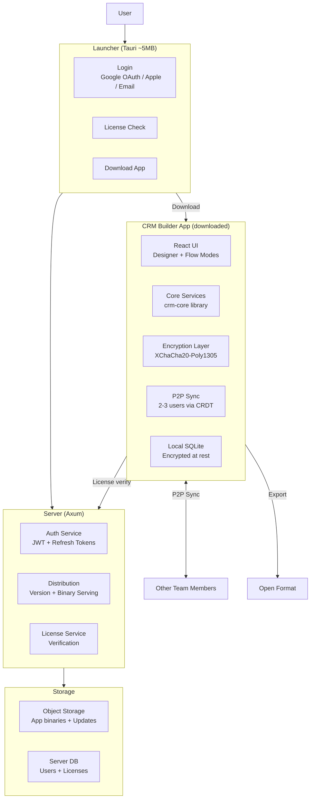
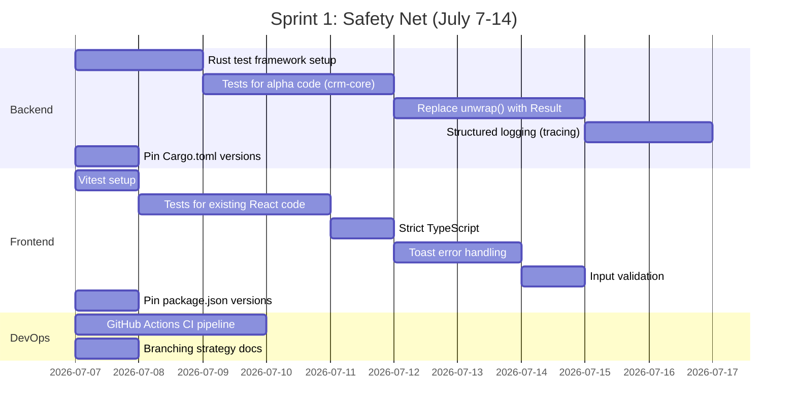
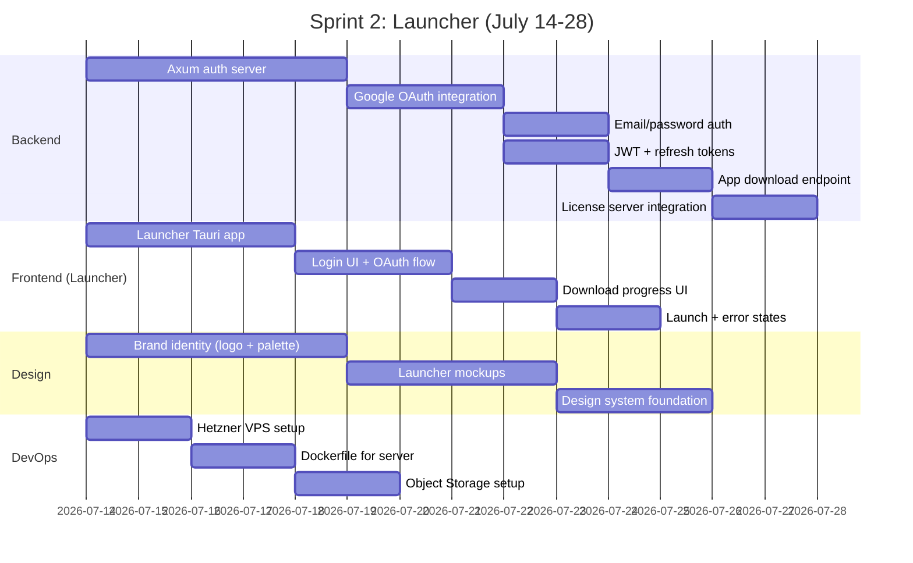
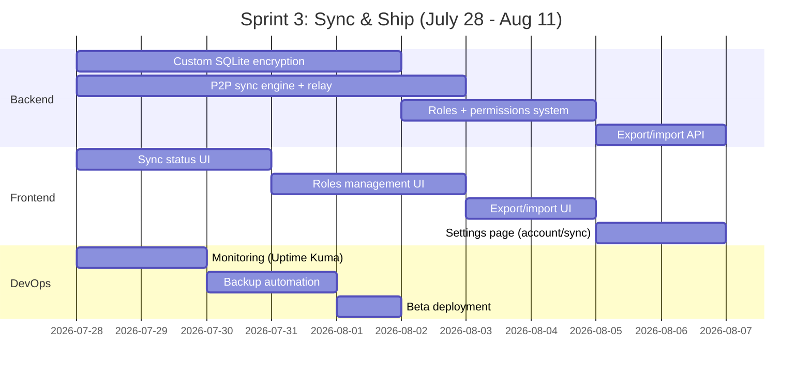
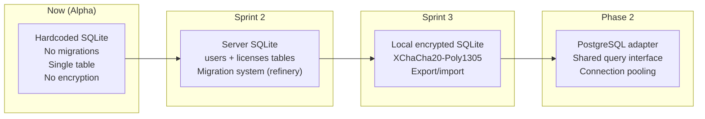

---
tags:
  - developer/architecture
aliases:
  - Foundation
  - Target Architecture
---
# Foundation Architecture

> The real foundation we need to build. Updated 2026-07-04 with launcher model + sprint plan.

## Target Architecture

## Sprint Plan

### Sprint 1: "Safety Net" — July 7-14

### Sprint 2: "Launcher" — July 14-28

### Sprint 3: "Sync & Ship" — July 28 - Aug 11

## Database Migration Path

## Architecture Decision Records

| ADR | Decision | Rationale |
|-----|----------|-----------|
| ADR-014 | Launcher model | Like War Thunder: auth before app. Prevents unlicensed use |
| ADR-015 | Google OAuth primary | Most popular auth method globally |
| ADR-016 | Local SQLite encryption | XChaCha20-Poly1305. Prevents casual data transfer |
| ADR-017 | P2P for 2-3 users | Free tier sync without server costs |
| ADR-018 | Hub-and-spoke relay | Simpler than true P2P for small teams |
| ADR-019 | SQLCipher via rusqlite | Simplest path to encrypted SQLite |
| ADR-020 | yrs (Yrs crate) for CRDT | Rust-native, JSON support, Yjs compatibility |

Related: [[02 - Architecture|Architecture]] | [[08 - Database Schema|Schema]] | [[09 - Build & Deploy|Deploy]]
