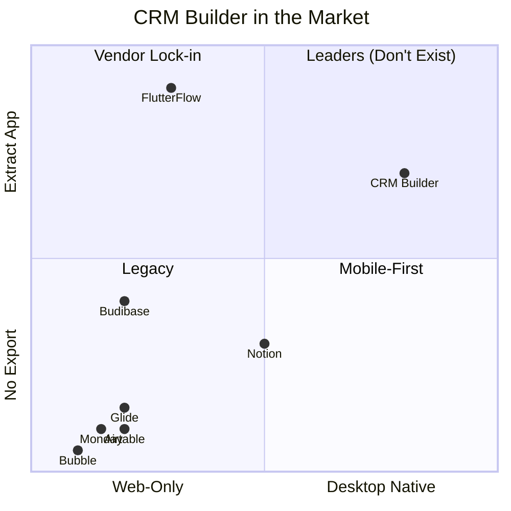
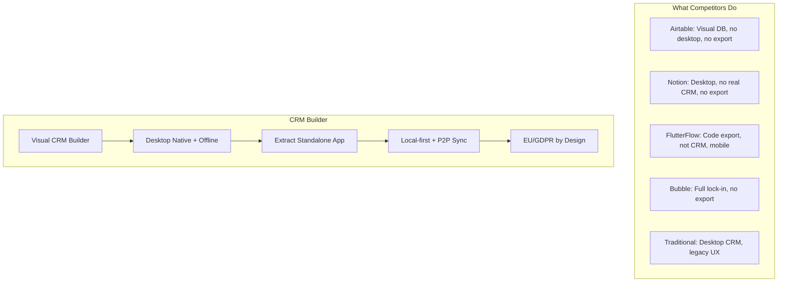

---
tags:
  - developer/market
aliases:
  - Market Analysis
  - Competitors
---
# Competitive Analysis

> Research conducted 2026-07-04 by all agents. Summary for CEO.

## The Landscape

## Competitor Matrix

| Company | Type | Desktop? | Export App? | CRM? | Price/user/mo | Gaps |
|---------|------|----------|-------------|------|---------------|------|
| **Airtable** | Spreadsheet-DB | No | No | Kinda | $20 | No offline, expensive per-seat, vendor lock-in |
| **Monday.com** | Work OS | No | No | Add-on | $12-28 | 3-seat min, CRM sold separately, no export |
| **Notion** | Workspace | Yes | No | Via templates | $10 | Not a real CRM, slow at scale, no charts |
| **Budibase** | Low-code | No | Self-host only | No | Free/$50 | Dev-focused, not CRM, no desktop |
| **FlutterFlow** | Visual app builder | No | **YES (code)** | No | $30-70 | Mobile-first, not CRM, backend costs separate |
| **Bubble** | No-code web apps | No | **NO** | No | $29-349 | **Complete vendor lock-in**, no code export |
| **Glide** | Data apps/PWA | PWA only | No | Kinda | $19-199 | Limited customization, no export |
| **Retool** | Internal tools | No | No | No | $10-50 | Expensive at scale, dev-focused |
| **Traditional CRMs** | Act!, SuiteCRM | Yes | No | Yes | $15-60 | Legacy UI, no visual builder, no modern UX |

## The Gap CRM Builder Fills

**No existing competitor combines all three:**
1. Visual CRM builder (design your data model visually)
2. Desktop native app with offline/local storage
3. Extract your CRM as a standalone app

Every competitor has at least one fatal gap:
- **Airtable/Monday/Bubble**: Cloud-only lock-in, no offline, no export
- **Notion**: Not a real CRM, no visual builder for data models
- **FlutterFlow**: Has code export but not CRM-focused, mobile-first
- **Traditional CRMs**: Legacy UX, no visual builder, no app extraction

## CRM Builder's Unique Position

## Go-to-Market Positioning

**Tagline concept:** *Build your CRM. Own your app.*

**Positioning statement:**
"For small businesses that need a custom CRM, CRM Builder is the only visual tool that lets you design your CRM visually and extract it as a standalone desktop app you truly own — unlike Airtable or Bubble that lock you into their cloud."

**Target niche (Phase 1):**
- Greek/EU micro-businesses (1-10 employees)
- Currently using Excel + paper
- Need simple CRM but can't afford $20/seat/month
- Privacy-conscious (GDPR)

## Key Numbers

- **Free tier**: 1 user, all features
- **Paid**: ~EUR 10-50/mo for teams (vs Airtable $20/seat = $100/mo for 5)
- **Lifetime**: EUR 300-400 (vs Bubble lock-in: priceless)
- **Extraction**: Included free (vs FlutterFlow $70/mo for code export)

Related: [[../Agent/Decisions|Decisions]] | [[02 - Architecture|Architecture]]
