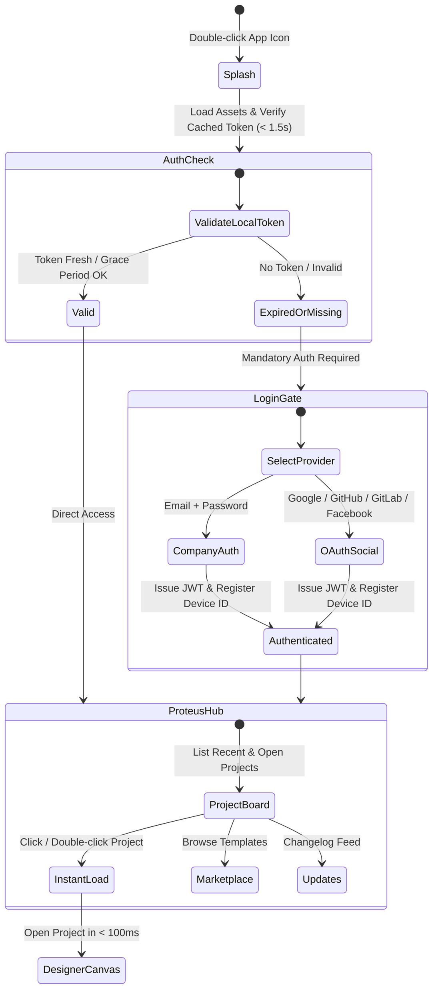

---
tags:
  - developer/architecture
  - ui/workspace
aliases:
  - Hub and Workspace Architecture
  - Dockable Panels & Smart Container
---
# Hub, Workspace & Smart Container Architecture

> Technical specification for startup lifecycle, mandatory auth gating, dockable workspace panels, and the smart container design element.

---

## 1. Application Lifecycle & Startup State Machine

---

## 2. Inspector Panel Two-Zone Layout (Photoshop/GIMP Standard)

The right panel (`project/crm-ui/src/inspector.rs`) is partitioned vertically into two distinct zones:

### Zone 1: Properties & Styling (Upper 2/3)
1. **Transform & Sizing:**
   - Position $(X, Y)$ and Dimensions $(W, H)$.
   - Quick dimension actions: Copy Dimensions (`Ctrl+Shift+C`), Paste Dimensions (`Ctrl+Shift+V`).
2. **Container Role Toggle:**
   - `Static Shape`: Acts purely as a visual backdrop / grouping background.
   - `Smart Cell / Input`: Binds to SQLite data fields, captures focus, enables data entry.
3. **Appearance:**
   - Background Color with full Alpha transparency slider.
   - Border / Stroke width slider & color picker.
   - Corner radius slider (0.0 to 40.0).
   - Content padding slider.
4. **Data Binding (for Smart Cells):**
   - Target Table (Entity) & Target Column (Field).

### Zone 2: Layer & Hierarchy Tree (Lower 1/3)
1. **Scene Graph Tree:**
   - Display node hierarchy (Parent frames $\rightarrow$ Containers $\rightarrow$ Child inputs / labels).
2. **Quick Controls:**
   - Lock/Unlock (🔒): Prevents accidental dragging/resizing on canvas.
   - Visibility (👁): Toggles rendering without deleting.
   - Z-Order controls: Bring Forward / Send Backward.

---

## 3. Smart Rulers & Alignment Guides

During drag and resize operations in `views/designer.rs`:
- **Bounding Box Projection:** The active element calculates horizontal and vertical edges ($X_1, X_{mid}, X_2$ and $Y_1, Y_{mid}, Y_2$).
- **Proximity Snap:** If within threshold ($\le 6\text{px}$) of any neighboring node:
  - The coordinate snaps to exact alignment.
  - A transient magenta/cyan guide line is rendered across the canvas using `egui::Painter`.

---

## 4. Dockable Panel Configuration

The default layout initializes four dockable panels with user-customizable positioning:
1. **Pages & Work Tree:** Left panel (Pages, Canvas Hierarchy, Assets).
2. **Central Canvas:** Viewport with 2D pan/zoom and dot-matrix grid.
3. **Inspector & Layers:** Right panel (Properties top 2/3, Scene layers bottom 1/3).
4. **Database & Logic Flow:** Bottom dock / toggleable drawer (SQLite live records browser & DAG visual automation flow).
