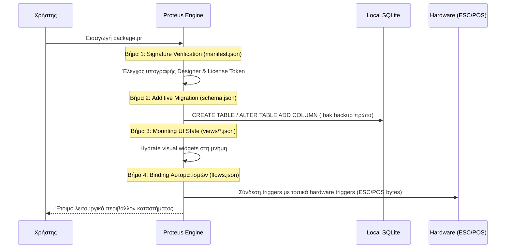

---
tags:
  - developer/architecture
  - business/blueprint
  - proteus/bos
aliases:
  - Proteus BOS Blueprint
  - Architectural & Business Blueprint
  - Service BOS Architecture
---
# Proteus BOS: The Architectural & Business Blueprint

> **Status:** Active Master Specification (Effective: September 14, 2026)  
> **Target:** Autonomous Service BOS (Shop Operations System) + Declarative Engine  
> **Immediate Execution:** 6-Week Pre-Enlistment Sprint (Windows Desktop MVP: Sep 14 – Oct 31, 2026)

---

## 1. Το Όραμα & Η Στρατηγική Αλλαγή (The Paradigm Shift)

### Από το Αφηρημένο "CRM Builder" στο Στοχευμένο "Service BOS"

Η αρχική σύλληψη ενός γενικού visual CRM Builder αντιμετωπίζει το κλασικό παράδοξο του άδειου καμβά: οι επιχειρήσεις δεν αγοράζουν εργαλεία ανάπτυξης λογισμικού, αγοράζουν άμεση ανακούφιση σε συγκεκριμένα προβλήματα.

#### Ο Κανόνας 90/10 της Αγοράς

| Κατηγορία Χρηστών | Ποσοστό | Χαρακτηριστικά & Ανάγκες | Συμπεριφορά στο Προϊόν |
| :--- | :--- | :--- | :--- |
| **Χειριστές / Operators** | **90% – 95%** | Ιδιοκτήτες συνεργείων, τεχνικών γραφείων, επισκευαστικών κέντρων και αποθηκών. | Απαιτούν σύστημα έτοιμο προς χρήση από το πρώτο δευτερόλεπτο. Αν αντικρίσουν άδειο πίνακα βάσεων δεδομένων, εγκαταλείπουν την εφαρμογή. |
| **Δημιουργοί / Builders & Agencies** | **5% – 10%** | Freelancers, IT integrators και designers. | Αναζητούν ισχυρή, επεκτάσιμη υποδομή για να στήνουν λύσεις κατά παραγγελία για λογαριασμό τρίτων. |

#### Το Σημείο Εισόδου (The Wedge)
Η είσοδος στην αγορά γίνεται αποκλειστικά μέσω της ροής **«Παραλαβή $\rightarrow$ Επισκευή $\rightarrow$ Παράδοση» (Service & Intake Tracking)**. Αντικαθιστά τα φυσικά τετράδια, τα χαμένα post-it και τα δυσκίνητα Excel με ένα offline-first σύστημα που εκτελείται ακαριαία, συνδέεται με θερμικούς εκτυπωτές δελτίων παραλαβής και παρακολουθεί την εξέλιξη των εργασιών σε οπτικό pipeline.

#### Η Ταυτότητα του Proteus
Το Proteus δεν διαφημίζεται ως low-code πλατφόρμα, αλλά ως **το ταχύτερο, αυτόνομο λειτουργικό σύστημα διαχείρισης καταστήματος (Shop Business OS)**, πάνω στο οποίο μπορούν να προστεθούν σταδιακά custom modules.

```
+-------------------------------------------------------------------+
|                        THE PROTEUS FLYWHEEL                       |
|                                                                   |
|   [ Free Native Studio ] ---> [ High-Yield Designers (90%) ]      |
|             ^                                 |                   |
|             |                                 v                   |
|   [ Ecosystem Growth ] <--- [ B2B Customers & Local IT Partners ] |
|             |                                 |                   |
|             +-------- [ Paid Engine & Seat Tiers ] <+             |
+-------------------------------------------------------------------+
```

---

## 2. Τεχνολογική Αρχιτεκτονική Πυρήνα (Core Technical Architecture)

### Το Μοντέλο "Single Official Binary + Declarative Engine"

Η ιδέα της δυναμικής παραγωγής ξεχωριστών binaries (`.exe` / `.apk`) ανά πελάτη εγκαταλείπεται οριστικά, καθώς οδηγεί σε αποκλεισμό από λειτουργικά συστήματα και προγράμματα προστασίας (SmartScreen, Antivirus heuristics). Το σύστημα διαχωρίζεται αυστηρά σε **δύο native εργαλεία**:

```
[ Proteus Studio (Native Rust/egui) ] 
       │ (Exports encrypted bundle)
       ▼
   [ package.pr ] (Declarative JSON/MsgPack + DDL Migrations + Assets)
       │
       +───► [ Web Hub / Licensing Server ] (Signature & Entitlement Gate)
                   │
                   ▼
[ Proteus Engine (Single Unified Signed Binary: Windows / macOS / Linux) ]
       │
       +───► Native Shell Companion (Android / iOS Declarative Client)
```

| Συνιστώσα | Ρόλος | Τεχνολογία | Χαρακτηριστικά |
| :--- | :--- | :--- | :--- |
| **Proteus Studio** | Εργαλείο Σχεδίασης | Rust (`egui` / `eframe`) | Παρέχεται δωρεάν. Σχεδιασμός φορμών, οντοτήτων, οπτικών κανόνων και αυτοματισμών DAG. Εξάγει ένα ενιαίο, κρυπτογραφημένο πακέτο δεδομένων (`.pr`). |
| **Proteus Engine** | Επιχειρησιακός Πυρήνας | Rust (`egui`, `rusqlite`) | Ένα ενιαίο, επίσημα υπογεγραμμένο binary. Δεν περιέχει hardcoded business logic. Λειτουργεί ως Declarative Interpreter: διαβάζει το `.pr`, εφαρμόζει το σχήμα βάσης, κλειδώνει τα interfaces και εκτελεί τις λειτουργίες τοπικά. |
| **Native Shell Companion** | Mobile Client | Native Shell (Android / iOS) | Ελαφριά native εφαρμογή με headless περιβάλλον εκτέλεσης. Κατεβάζει το mobile declarative view από τον τοπικό Host, αποθηκεύει τα δεδομένα σε πραγματική τοπική SQLite και εκτελείται αυτόνομα offline. |

### Αποθήκευση Δεδομένων & Ασφάλεια Διαδρομών

* **Εξάλειψη των Root Path Permissions:** Η SQLite δεν τοποθετείται ποτέ στον φάκελο εγκατάστασης (`C:\Program Files`).
* **Standard System Data Paths:**
  * **Windows:** `%APPDATA%\Proteus\data\store.db`
  * **Linux:** `~/.local/share/proteus/store.db`
  * **macOS:** `~/Library/Application Support/Proteus/store.db`
* **Zero-Privilege Startup:** Η εφαρμογή εκτελείται με δικαιώματα απλού χρήστη, εξασφαλίζοντας μηδενικά σφάλματα `EACCES / Permission Denied`.

---

## 3. Δικτύωση, Συγχρονισμός & Επιχειρησιακή Ανθεκτικότητα

```
               [ HOST PC (Shop Counter) ]
                   - Local SQLite Database (store.db)
                   - Listening Port (Local API: Rust/Axum)
                   - 30-Day Cryptographic Lease
                           ^
        +------------------+------------------+
        |                                     |
   (Local LAN / mDNS)                  (Remote 4G/5G)
        |                                     |
        v                                     v
[ LAN Client PC ]                     [ Encrypted Cloud Relay ]
  - Direct Read/Write                   (STUN/TURN Bridge)
                                              |
                                              v
                                     [ Mobile Companion ]
                                       - sync_outbox (SQLite)
                                       - Offline-First UI
```

### 1. Αρχιτεκτονική Local LAN & Dynamic Pairing
* **Host Mode:** Ένα κεντρικό PC στο κατάστημα αναλαμβάνει τον ρόλο του τοπικού εξυπηρετητή. Διαχειρίζεται το κύριο αρχείο `store.db` και εκθέτει ένα τοπικό ελαφρύ interface επικοινωνίας (HTTP/JSON ή gRPC μέσω Rust/Axum).
* **Local Discovery:** Οι υπόλοιποι σταθμοί εργασίας στο ίδιο δίκτυο εντοπίζουν τον Host αυτόματα μέσω **mDNS / Zeroconf**.
* **QR Pairing Fallback:** Για περιβάλλοντα με ενεργοποιημένο **AP Isolation** (όπου οι συσκευές Wi-Fi δεν βλέπονται μεταξύ τους), ο Host παράγει στην οθόνη του ένα QR Code που περιλαμβάνει:
  ```json
  {
    "host_ip": "192.168.1.50",
    "port": 8443,
    "cert_fingerprint": "SHA256:...",
    "pairing_token": "..."
  }
  ```
  Το κινητό σκανάρει το QR και συνδέεται απευθείας μέσω σταθερής IP χωρίς αναζήτηση broadcast.

### 2. Store-and-Forward Sync Engine (`sync_outbox`)
Όταν ένας εργαζόμενος βρίσκεται εκτός καταστήματος ή σε υπόγειο χωρίς σήμα:
* **Απομόνωση Εγγραφών:** Κάθε ενέργεια (αλλαγή status, υπογραφή, καταγραφή ανταλλακτικού) καταγράφεται άμεσα σε έναν τοπικό πίνακα ουράς στη συσκευή του:
```sql
CREATE TABLE IF NOT EXISTS sync_outbox (
    event_id TEXT PRIMARY KEY,        -- UUIDv7 (Χρονολογικά ταξινομημένο)
    entity_type TEXT NOT NULL,       -- π.χ. 'service_ticket'
    entity_id TEXT NOT NULL,         -- UUID του record
    field_name TEXT NOT NULL,        -- π.χ. 'status'
    old_value TEXT,
    new_value TEXT,
    client_timestamp INTEGER NOT NULL, -- Unix epoch ms (Monotonic)
    sync_status TEXT DEFAULT 'pending' -- pending, syncing, acked, rejected
);
```
* **Flushing Strategy:** Μόλις εντοπιστεί δίκτυο (Wi-Fi ή 4G), το σύστημα εκτελεί batch upload των εκκρεμών συμβάντων. Μετά την επιβεβαίωση (`200 OK`) από τον Host, τα records μαρκάρονται ως `acked` και εκκαθαρίζονται.

### 3. Μοντέλο Επίλυσης Συγκρούσεων (Hybrid Conflict Resolution)

| Τύπος Δεδομένων | Στρατηγική Επίλυσης | Μηχανισμός |
| :--- | :--- | :--- |
| **Metadata & Σημειώσεις** | **Field-Level LWW (Last-Write-Wins)** | Κάθε στήλη συνοδεύεται από timestamp τελευταίας τροποποίησης. Αν το κατάστημα αλλάξει το τηλέφωνο του πελάτη και ο τεχνικός στο πεδίο αλλάξει τις σημειώσεις, διατηρούνται και οι δύο αλλαγές χωρίς απώλειες. |
| **Περιορισμένοι Πόροι (Αποθέματα / Stock & Ραντεβού)** | **Strict Reservation Tokens** | Αποθέματα και slots **δεν επιτρέπεται** να επιλύονται με LWW. Το κινητό offline επιτρέπει μόνο «Προσωρινή Δέσμευση (Pending Confirmation)». Η οριστική αφαίρεση κατοχυρώνεται μόνο όταν το event φτάσει στον Host και επιβεβαιωθεί υπόλοιπο $> 0$. Αν εξαντλήθηκε, αποστέλλεται άμεση ειδοποίηση απόρριψης. |

### 4. Zero-Knowledge Automated Cloud Snapshots
* **Τοπική Δημιουργία Snapshot:** Κάθε βράδυ, το Proteus Engine παράγει consistency snapshot της SQLite (`VACUUM INTO`).
* **Κρυπτογράφηση XChaCha20-Poly1305:** Το snapshot κρυπτογραφείται τοπικά με κλειδί που παράγεται από τον κωδικό της επιχείρησης μέσω Argon2id.
* **Zero-Knowledge Upload:** Το κρυπτογραφημένο αρχείο αποστέλλεται αυτόματα σε cloud storage (S3-compatible / Cloudflare R2). Ο server φιλοξενίας δεν κατέχει ποτέ το κλειδί αποκρυπτογράφησης.

---

## 4. Ο Οδικός Χάρτης Επίλυσης των 21 Προβλημάτων

| # | Εντοπισμένο Πρόβλημα | Κατηγορία | Οριστική Τεχνική / Επιχειρησιακή Λύση |
| :---: | :--- | :--- | :--- |
| **1** | Windows File Permissions crash στο `C:\Program Files` | OS / Filesystem | Αποκλειστική χρήση του standard φακέλου δεδομένων συστήματος `%APPDATA%\Proteus\data`. |
| **2** | Windows SmartScreen αποκλεισμός (Untrusted Binary Hash) | Security / OS | **Ένα ενιαίο, σταθερό binary** (`Proteus.exe`). Το binary συγκεντρώνει downloads και reputation. Τα custom designs διαβάζονται ως εξωτερικά δεδομένα (`.pr`). |
| **3** | Apple Notarization & Gatekeeper failure στο macOS | macOS System | Ένα επίσημα signed & notarized macOS App Bundle. Μηδενική παραγωγή δυναμικών binaries στο cloud. |
| **4** | Antivirus False Positives από binary injection heuristics | Security Heuristics | **Κατάργηση του binary modification**. Το `.pr` φορτώνεται στη μνήμη μέσω ασφαλούς deserializer (MessagePack/JSON parser) χωρίς να τροποποιείται το εκτελέσιμο. |
| **5** | Apple App Store Guideline 4.7 (Απαγόρευση dynamic code) | Mobile Compliance | Το Companion App λειτουργεί ως **Server-Driven UI interpreter**. Διαβάζει διατάξεις δεδομένων και χρησιμοποιεί native platform components. |
| **6** | Αδυναμία Sideloading στο iOS οικοσύστημα | Mobile Distribution | Ένα επίσημο universal shell ("Proteus Companion") στο App Store. Το pairing φορτώνει το εκάστοτε template δυναμικά. |
| **7** | Το τείχος του CGNAT στα 4G/5G κινητά τηλέφωνα | Networking | Ενσωμάτωση ελαφρού **Cloud Relay Tunnel** (WebRTC data channels / WireGuard-based relay) για διασύνδεση εκτός LAN χωρίς port forwarding. |
| **8** | AP / Client Isolation στα επαγγελματικά Wi-Fi routers | Networking | **QR Code Fallback**. Εμφάνιση των παραμέτρων δικτύου και direct IP binding στην οθόνη του Host μέσω scanner. |
| **9** | Background Socket Termination από OS battery optimization | Mobile OS | Χρήση επίσημων push relay channels (Firebase Cloud Messaging & Apple APNs) για background wake-up pings. |
| **10** | Απώλεια διαθεσιμότητας Host PC (Sleep Mode / Shutdown) | Infrastructure | Πλήρης αυτονομία των Mobile clients μέσω `sync_outbox`. Δυνατότητα απρόσκοπτης εργασίας έως 48 ώρες χωρίς σύνδεση με τον Host. |
| **11** | Αστάθεια Hardware Fingerprints (BIOS/OS Updates) | Licensing | **Self-Service Device Management**. Web portal όπου ο ιδιοκτήτης μπορεί να ανακαλέσει παλιές/φορμαρισμένες συσκευές (όριο: 1 reset/μήνα). |
| **12** | False Positives από άδεια μπαταρία CMOS (Clock Rollback) | Security Engine | **Monotonic Event Sequence & NTP check**. Η εφαρμογή ελέγχει την ώρα μέσω δικτύου. Αν είναι offline, ελέγχει μόνο αν τα νέα internal events έχουν αυξανόμενο sequence ID. |
| **13** | Παράλυση καταστήματος από αποτυχία κάρτας (Hard Lockout) | B2B Operations | **Grace Period 7 ημερών + Read-Only Fallback**. Σε λήξη συνδρομής, κλειδώνουν οι εγγραφές, αλλά διατηρείται η πλήρης ανάγνωση και εξαγωγή σε Excel. |
| **14** | The Inventory Trap (Αρνητικά αποθέματα από LWW) | Data Integrity | **Διαχωρισμός πεδίων**. Metadata συγχωνεύονται με LWW. Υλικά και stock απαιτούν επιβεβαίωση από τον Host (Strict Reservation Tokens). |
| **15** | Καταστροφή δεδομένων από αναβαθμίσεις templates τρίτων | Data Integrity | **Additive-Only Migrations Engine**. Απαγόρευση `DROP TABLE / COLUMN`. Υποχρεωτικό αυτόματο SQLite backup (`.bak`) πριν από κάθε import νέας έκδοσης. |
| **16** | Platform Leakage (Συναλλαγές εκτός πλατφόρμας) | Business Model | **Μοντέλο Εγγύησης (Escrow)** για custom αναθέσεις + μετατόπιση της κύριας κερδοφορίας στις άδειες εκτέλεσης (Runtime Seat Subscriptions). |
| **17** | The WhatsApp Bypass (Αποφυγή πληρωμής ακριβών αδειών) | Business Model | **Διαχωρισμός Αδειών (Role-Based Pricing)**. Πλήρης τιμή για Back-Office Seats. Εξαιρετικά χαμηλό κόστος για Field Workers (π.χ. 1,50€/μήνα). |
| **18** | Έλλειψη γνώσεων Database & Networking από Designers | Ecosystem Roles | Αυστηρός διαχωρισμός καθηκόντων: οι Designers σχεδιάζουν μόνο UI/Layouts. Τη διαχείριση δικτύων αναλαμβάνουν **τοπικοί τεχνικοί (Certified Partners)**. |
| **19** | Onboarding Friction από παλιά αρχεία πελατών | UX Onboarding | **Universal Smart CSV/Excel Importer**. Αυτόματο mapping στηλών («Όνομα», «Τηλέφωνο») και ταχύτατη μαζική εισαγωγή στην SQLite. |
| **20** | Νομικό τείχος παγκόσμιων φορολογικών μηχανισμών (myDATA, TSE, NF525 κ.α.) | Global Compliance | **Απομόνωση φορολογικής ευθύνης παγκοσμίως**. Το Proteus παράγει αποκλειστικά εσωτερικά δελτία παραλαβής (Operational Job Orders). Συνδέεται προαιρετικά μέσω API/Webhooks με τοπικούς παρόχους. |
| **21** | Scope Creep & Έλλειψη Χρόνου μέχρι την Κατάταξη | Project Management | **Ριζική περικοπή στο MVP**. Πάγωμα marketplace και cloud components. Εστίαση αποκλειστικά σε ένα ενιαίο Windows Desktop binary για Service Tracking. |

---

## 5. Το Επιχειρησιακό & Οικονομικό Μοντέλο (The Business Engine)

```
                       [ PROTEUS HUB REVENUE FLOW ]
                                     │
         ┌───────────────────────────┴───────────────────────────┐
         ▼                                                       ▼
 [ Template Sales / Commissions ]                        [ Runtime Subscriptions ]
         │                                                       │
  ┌──────┴──────┐                                         ┌──────┴──────┐
  ▼             ▼                                         ▼             ▼
Designer    Proteus Hub                               Proteus Hub    Designer
 (90%)         (10%)                                    (98-99%)    Royalty (1-2%)
```

### 1. Κατανομή Εσόδων Template & Marketplace
* **Πώληση Προτύπου (Upfront Sale):**
  * **90% στον Designer:** Για template αξίας 100€, ο δημιουργός λαμβάνει 90€.
  * **10% στο Proteus Hub:** Κάλυψη κόστους payment gateway και υποδομής.
* **Μηνιαίο Royalty Συνδρομής (Recurring Incentive):**
  * Ο designer λαμβάνει **1% – 2%** επί των μηνιαίων συνδρομών που πληρώνει κάθε επιχείρηση η οποία διατηρεί ενεργό το template του (κίνητρο για σχεδίαση σταθερών, ποιοτικών λύσεων με χαμηλό churn).

### 2. Τιμολόγηση Υποδομής & Αδειών Χρήσης (Runtime Seats)

| Τύπος Άδειας / Υπηρεσίας | Μηνιαίο Κόστος | Δικαιώματα & Περιεχόμενο |
| :--- | :--- | :--- |
| **Core Business License** | **7,99€ / μήνα** | Περιλαμβάνει τον Host υπολογιστή και έως 2 πλήρεις θέσεις εργασίας. |
| **Back-Office Seat** | **+3,50€ / μήνα ανά σταθμό** | Πλήρη δικαιώματα διαχείρισης, ρυθμίσεων, αναφορών. |
| **Field / Mobile Seat** | **+1,50€ / μήνα ανά χρήστη** | Περιορισμένη πρόσβαση: βλέπει μόνο ανατεθειμένα tasks, χάρτες, δελτία παραλαβής. |
| **Cloud Backup Vault (Standard)** | **2,99€ / μήνα** | Έως 2 GB (SQLite data consistency snapshots). |
| **Cloud Backup Vault (Media Archive)** | **8,99€ / μήνα** | Έως 50 GB (φωτογραφίες βλαβών, παραλαβών, εγγράφων). |

---

## 6. Σταδιοδρομία, Νομική Μορφή & Στρατηγική Εκτέλεσης

```
[ ΣΗΜΕΡΑ: 14 ΣΕΠΤΕΜΒΡΙΟΥ 2026 ]
       │
       │  Sprint 6 Εβδομάδων: Windows MVP (Rust/egui + SQLite + ESC/POS)
       ▼
[ 1η ΝΟΕΜΒΡΙΟΥ 2026: ΚΑΤΑΤΑΞΗ ΣΤΟΝ ΣΤΡΑΤΟ ]
       │
       │  6μηνη Θητεία: Μηδενικά έξοδα, πιλοτικό feedback από 2-3 καταστήματα
       ▼
[ ΜΑΪΟΣ 2027: ΑΠΟΛΥΣΗ ΑΠΟ ΤΟΝ ΣΤΡΑΤΟ ]
       │
       │  Εμπορικό Launch μέσω Lemon Squeezy (Merchant of Record)
       ▼
[ ΠΡΩΤΑ ΕΠΙΒΕΒΑΙΩΜΕΝΑ ΕΣΟΔΑ (>2.000€) ]
       │
       ▼
[ ΙΔΡΥΣΗ ΜΟΝΟΠΡΟΣΩΠΗΣ ΙΚΕ (gov.gr) ]
```

### Φάση 1: Το Sprint Προ Κατάταξης (14 Σεπτεμβρίου – 31 Οκτωβρίου 2026)
* **Στόχος:** Ένα πλήρως λειτουργικό, αυτόνομο Windows Desktop Binary (`.exe`).
* **Πεδίο Υλοποίησης:**
  1. Τοπική SQLite βάση με schema για Service & Παραλαβές (`service_tickets`, `system_events`).
  2. UI σε `egui` με 3 βασικές οθόνες: *Νέα Παραλαβή*, *Kanban Pipeline Επισκευών* (6 καταστάσεις), *Καρτέλα Πελάτη*.
  3. Direct εκτύπωση εσωτερικού δελτίου παραλαβής σε θερμικό εκτυπωτή ESC/POS μέσω USB.
* **Οικονομικό Καθεστώς:** Καμία ίδρυση εταιρείας, κανένα φορολογικό έξοδο.

### Φάση 2: Η Εξάμηνη Στρατιωτική Θητεία (Νοέμβριος 2026 – Μάιος 2027)
* **Στρατηγική Διατήρησης:** Τα πάγια έξοδα παραμένουν στο **απόλυτο μηδέν**.
* **Πιλοτική Δοκιμή:** Το MVP τοποθετείται σε 2–3 φιλικά καταστήματα (συνοικιακό συνεργείο, τεχνικός υπολογιστών).
* **Feedback:** Συγκέντρωση πραγματικού feedback χρήσης και διόρθωση σφαλμάτων στον πυρήνα κατά τις άδειες/εξόδους.

### Φάση 3: Εμπορική Εκκίνηση & Merchant of Record (Μάιος 2027)
* **Διάθεση Αδειών:** Μέσω πλατφόρμας **Merchant of Record (MoR)** (Lemon Squeezy ή Paddle).
* **Οφέλη MoR:**
  * Αυτόματη διαχείριση διεθνούς ΦΠΑ (EU VAT, sales tax).
  * Έκδοση αποδείξεων προς τους τελικούς πελάτες.
  * Παρακράτηση χρημάτων σε escrow μέχρι την επίσημη εκταμίευση.

### Φάση 4: Ίδρυση Μονοπρόσωπης ΙΚΕ
* **Κανόνας Εκκίνησης:** Η ίδρυση εταιρείας πραγματοποιείται **μόνο** όταν υπάρχουν αποδεδειγμένα, εκκαθαρισμένα έσοδα στον MoR λογαριασμό (π.χ. >2.000€–3.000€).
* **Διαδικασία:** Ηλεκτρονική ίδρυση Μονοπρόσωπης ΙΚΕ μέσω Υπηρεσίας Μιας Στάσης (gov.gr) μέσα σε 24 ώρες, με ελάχιστο αρχικό κεφάλαιο και νομική προστασία προσωπικής περιουσίας.

---

## 7. Βασικό Σχήμα Βάσης Δεδομένων MVP (SQLite DDL)

```sql
-- Core Table: Tickets / Repairs
CREATE TABLE IF NOT EXISTS service_tickets (
    ticket_id TEXT PRIMARY KEY,           -- UUIDv7
    ticket_number INTEGER NOT NULL,      -- Αύξων αριθμός παραλαβής καταστήματος
    customer_name TEXT NOT NULL,
    customer_phone TEXT NOT NULL,
    device_model TEXT NOT NULL,          -- π.χ. 'Samsung Galaxy S22' ή 'Yamaha Crypton'
    serial_number TEXT,
    reported_fault TEXT NOT NULL,        -- Περιγραφή βλάβης από τον πελάτη
    internal_notes TEXT,                 -- Σημειώσεις τεχνικού
    estimated_cost REAL DEFAULT 0.0,
    current_status TEXT NOT NULL CHECK(
        current_status IN ('received', 'in_progress', 'waiting_parts', 'ready', 'delivered', 'cancelled')
    ),
    created_at INTEGER NOT NULL,          -- Epoch ms
    updated_at INTEGER NOT NULL,          -- Epoch ms (LWW anchor)
    delivered_at INTEGER
);

-- Core Table: Event Log for Local Auditing & Sync
CREATE TABLE IF NOT EXISTS system_events (
    event_id TEXT PRIMARY KEY,
    entity_id TEXT NOT NULL,
    event_type TEXT NOT NULL,            -- 'TICKET_CREATED', 'STATUS_CHANGED', etc.
    payload JSON NOT NULL,
    created_at INTEGER NOT NULL
);

-- Indexing for Fast Pipeline Queries
CREATE INDEX IF NOT EXISTS idx_tickets_status ON service_tickets(current_status);
CREATE INDEX IF NOT EXISTS idx_tickets_phone ON service_tickets(customer_phone);
CREATE INDEX IF NOT EXISTS idx_tickets_updated ON service_tickets(updated_at);
```

---

## 8. Η Ροή του Αρχείου (.pr Pipeline) & Ανατομία Πακέτου

```
[ Proteus Studio ] 
       │
       ▼ (Export)
   [ package.pr ]  ──(Μεταφορά: Marketplace / USB / Local LAN / Web)──►  [ Proteus Client ]
                                                                               │
                                                                               ▼ (Import & Mount)
                                                                       [ Local SQLite + UI ]
```

### Ανατομία του Πακέτου `.pr` (The Bundle Structure)
Το `.pr` είναι ένα συμπιεσμένο και κρυπτογραφικά υπογεγραμμένο archive (zstd-compressed TAR ή MessagePack bundle) που περιέχει **αποκλειστικά declarative δεδομένα**:

```text
my_service_template.pr
├── manifest.json       # Metadata, έκδοση, licensing ID & cryptographic signature
├── schema.json         # Additive DDL: Ορισμός πινάκων, πεδίων και σχέσεων
├── views/              # Δηλώσεις UI (Forms, Kanban pipelines, Grids, Detail views)
│   ├── desktop.json    # Layout για οθόνη υπολογιστή
│   └── mobile.json     # Συμπτυγμένο layout για το companion app
├── flows.json          # Workflow triggers (π.χ. Status -> "Ready" triggers Print Job)
└── assets/             # Εικονίδια, λογότυπα και πρότυπα θερμικού εκτυπωτή (ESC/POS)
```

### Ο Μηχανισμός Ingestion στον Client (4 Βήματα Συναλλαγής)



1. **Επαλήθευση Υπογραφής (Signature Verification):**
   Διαβάζει το `manifest.json`. Ελέγχει ότι το template προέρχεται από πιστοποιημένο designer και ότι το license token αντιστοιχεί στον ενεργό λογαριασμό.
2. **Ασφαλές Schema Migration (Additive Only):**
   Διαβάζει το `schema.json`. Ελέγχει την τοπική SQLite:
   * Πρώτη εγκατάσταση: εκτέλεση `CREATE TABLE` και `CREATE INDEX`.
   * Αναβάθμιση: προσθήκη μόνο νέων στηλών (`ALTER TABLE ADD COLUMN`). Απορρίπτεται αυτόματα οποιαδήποτε εντολή διαγραφής δεδομένων (`DROP`).
3. **Mounting του UI State:**
   Το native engine διαβάζει τα layout JSON αρχεία και κάνει hydrate τα visual widgets (φόρμες παραλαβής, πίνακες επισκευών) στη μνήμη.
4. **Binding Αυτοματισμών:**
   Συνδέει τα κουμπιά και τις αλλαγές καταστάσεων με τοπικά hardware triggers (π.χ. αποστολή raw ESC/POS bytes στον εκτυπωτή όταν πατηθεί το κουμπί «Εκτύπωση Δελτίου»).

### Γιατί η Προσέγγιση είναι Αλεξίσφαιρη

| Χαρακτηριστικό | Πλεονέκτημα | Επιχειρησιακή Αξία |
| :--- | :--- | :--- |
| **Μηδενικό Recompilation** | Ο client δεν χρειάζεται compilers ή Rust toolchains. Το binary μένει ανέπαφο. | Εγκατάσταση σε απλούς χρήστες χωρίς dependencies. |
| **Μηδενικά False Positives AV** | Το εκτελέσιμο αρχείο (`Proteus.exe`) δεν τροποποιείται ποτέ στο δίσκο. Απλώς διαβάζει ένα εξωτερικό data file (`.pr`). | Αποφυγή αποκλεισμών από Windows Defender & Antivirus heuristics. |
| **Απόλυτη Φορητότητα & Backups** | Ολόκληρο το στήσιμο συνοψίζεται σε 2 αρχεία: `template.pr` (UI & workflows) και `store.db` (δεδομένα). | Backup & restore με απλό drag & drop ή αυτόματο cloud snapshot. |

---

Related: [[../Agent/Board|Sprint 5 Board]] | [[../Agent/Decisions|Decisions]] | [[08 - Database Schema|Database Schema]] | [[02 - Architecture|System Architecture]]
