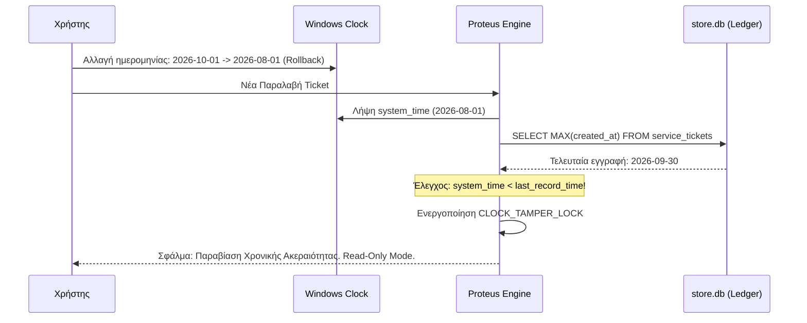
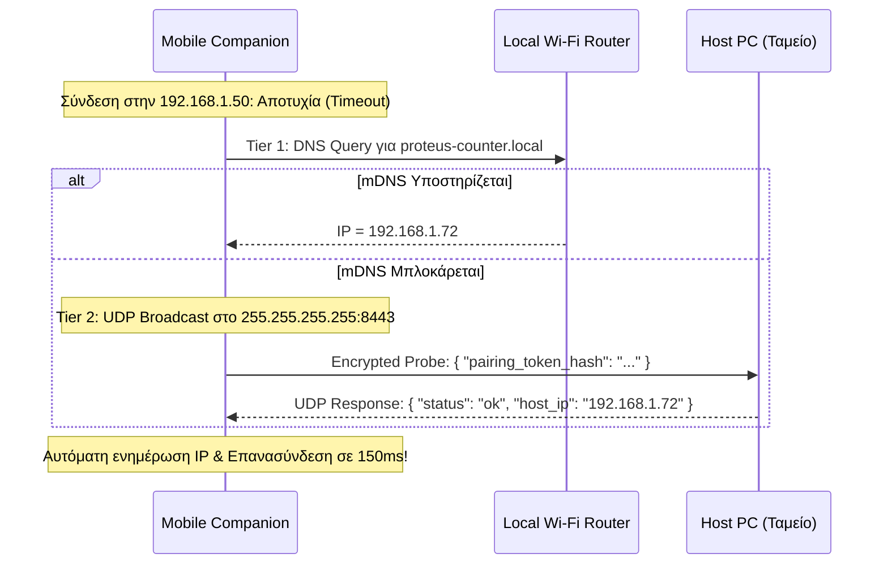

---
tags:
  - developer/architecture
  - security/audit
  - marketplace/contracts
  - proteus/specs
aliases:
  - Master Problem Audit
  - 21 Architectural Solutions
  - Proteus Hardening Specification
---
# Proteus BOS: Master Problem Audit & Complete Technical Solutions (P1 – P21)

> **Status:** Active Master Specification (Effective: September 14, 2026)  
> **Total Identified Problems:** **21 Κρίσιμα Προβλήματα & Τεχνικές Λύσεις**  
> **Core Principle:** 100% Original, First-Principles Engineering — Μηδενική εξάρτηση, απόλυτη αυτονομία καταστήματος.

---

## Περιεχόμενα

1. [Συνοπτικός Πίνακας των 21 Προβλημάτων](#συνοπτικός-πίνακας-των-21-προβλημάτων)
2. [Τομέας Α: Ασφάλεια, Κρυπτογραφία & Άδειες Χρήσης (P1 – P5)](#τομέας-α-ασφάλεια-κρυπτογραφία--άδειες-χρήσης-p1--p5)
3. [Τομέας Β: Δικτύωση LAN, Dynamic IPs & Mobile Pairing (P6 – P10)](#τομέας-β-δικτύωση-lan-dynamic-ips--mobile-pairing-p6--p10)
4. [Τομέας Γ: Ακεραιότητα Βάσης & Additive Migrations (P11 – P14)](#τομέας-γ-ακεραιότητα-βάσης--additive-migrations-p11--p14)
5. [Τομέας Δ: Windows Hardware & ESC/POS Εκτυπωτές (P15 – P17)](#τομέας-δ-windows-hardware--escpos-εκτυπωτές-p15--p17)
6. [Τομέας Ε: Marketplace, Custom Συμβόλαια & In-App Share Point (P18 – P21)](#τομέας-ε-marketplace-custom-συμβόλαια--in-app-share-point-p18--p21)

---

## Συνοπτικός Πίνακας των 21 Προβλημάτων

| # | Τομέας | Πρόβλημα / Κενό Ασφαλείας | Σοβαρότητα | Οριστική Αρχιτεκτονική Λύση |
| :---: | :--- | :--- | :---: | :--- |
| **P1** | Security | Offline επαλήθευση `.pr` χωρίς Root of Trust | 🔴 Υψηλή | Ασύμμετρη κρυπτογραφία Ed25519 & Certificate Chain. |
| **P2** | Security | Declarative DoS / Ατέρμονες βρόχοι στο DAG | 🔴 Υψηλή | Static Cycle Detection (Tarjan) + Όριο βάθους 16 hops. |
| **P3** | Licensing | Παραβίαση 30-day lease με γύρισμα ρολογιού | 🔴 Υψηλή | Monotonic Ledger Validation έναντι database timestamp. |
| **P4** | Security | Κόπωση κωδικών πρόσβασης στο ταμείο | 🟡 Μεσαία | Hybrid Hardware Key (DPAPI/TPM) + Master Owner Pass. |
| **P5** | Licensing | Πειρατεία πακέτων `.pr` μεταξύ καταστημάτων | 🔴 Υψηλή | Client-Specific Machine Binding στο manifest. |
| **P6** | Networking | Αλλαγή IP του Host λόγω DHCP | 🔴 Υψηλή | Zero-Config Subnet Probe (UDP broadcast) + mDNS. |
| **P7** | Networking | AP / Client Isolation στα επαγγελματικά Wi-Fi | 🔴 Υψηλή | Ethernet Host Bridging + Encrypted Cloud Relay Fallback. |
| **P8** | Networking | Αναστολή λειτουργίας Host PC (Windows Sleep) | 🟡 Μεσαία | OS Power Lock (`ES_SYSTEM_REQUIRED`) + Outbox Buffer. |
| **P9** | Networking | Υπερφόρτωση Cloud Relay από βαριές φωτογραφίες | 🟡 Μεσαία | Local Client WebP Compression (150KB) + Wi-Fi Full Sync. |
| **P10** | Mobile | Τερματισμός background sockets από το λειτουργικό | 🟡 Μεσαία | Lazy Opportunistic Batch Pull κατά το άνοιγμα της οθόνης. |
| **P11** | Database | Απώλεια δεδομένων από μετονομασία στηλών | 🔴 Υψηλή | Declarative Migration Rules (`alias_of` / copy on update). |
| **P12** | Database | Συγκρούσεις ονομάτων πινάκων μεταξύ modules | 🟡 Μεσαία | Υποχρεωτικό Namespace Prefixing (`pkg_{id}_{table}`). |
| **P13** | Operations | Η παγίδα της offline άρνησης αποθεμάτων (Stock) | 🔴 Υψηλή | Physical-First Reconciler: Αποδοχή (-1) + Discrepancy Ticket. |
| **P14** | Database | Αποτυχία `ALTER TABLE ADD COLUMN NOT NULL` | 🟡 Μεσαία | Studio Package Linter: Υποχρεωτικό DEFAULT value. |
| **P15** | Hardware | Windows Exclusive Port Lock σε USB εκτυπωτές | 🔴 Υψηλή | Εκτύπωση μέσω Windows Spooler API (`winspool.drv` RAW). |
| **P16** | Hardware | Παραμόρφωση εκτύπωσης (58mm vs 80mm χαρτί) | 🟡 Μεσαία | Responsive Declarative Layouts (32 vs 42/48 cols). |
| **P17** | OS / Paths | Προβλήματα δικαιωμάτων σε λογαριασμούς Guest | 🟢 Χαμηλή | Αποκλειστικά standard paths `%APPDATA%\Proteus\data`. |
| **P18** | Marketplace | Συνεργασία & Live Preview Πελάτη - Designer | 🔴 Υψηλή | Ενσωματωμένο In-App Share Point & Sandbox Mock View. |
| **P19** | Marketplace | Χαμηλή ποιότητα / κακογραμμένα templates | 🟡 Μεσαία | Πρόγραμμα Πιστοποίησης (Certified Designer) + Auto-Linter. |
| **P20** | Marketplace | Διαρροή συναλλαγών εκτός πλατφόρμας (Leakage) | 🔴 Υψηλή | Μοντέλο Εγγύησης Escrow & Cryptographic Release. |
| **P21** | Marketplace | Συντήρηση & μικροαλλαγές σε custom σχέδια | 🟡 Μεσαία | Additive Delta Updates (`.prupdate`) + Retainer Tickets. |

---

## Τομέας Α: Ασφάλεια, Κρυπτογραφία & Άδειες Χρήσης (P1 – P5)

### P1: Offline Επαλήθευση Υπογραφής `.pr` χωρίς Root of Trust

#### Ρίζα του Προβλήματος
Ένα κατάστημα λειτουργεί χωρίς σύνδεση στο internet (air-gapped ή τοπικό LAN). Εισάγει ένα πακέτο `custom_shop.pr`. Χωρίς κεντρικό server, πώς μπορεί το Engine να είναι βέβαιο ότι το πακέτο:
1. Κατασκευάστηκε από επίσημα πιστοποιημένο δημιουργό και όχι από κακόβουλο τρίτο;
2. Δεν έχει τροποποιηθεί (tampered) μετά την υπογραφή του;

#### Τεχνική Λύση: Ed25519 Certificate Chain
Το Proteus υιοθετεί ιεραρχία ασύμμετρων κλειδιών Ed25519:

```
[ Proteus Master Root Key (Asymmetric Ed25519) ]
       │ (Hardcoded Public Key εντός του Engine binary)
       ▼
[ Designer Intermediate Certificate ]
       │ - Designer Public Key
       │ - Permissions & Capabilities (π.χ. allowed DDL scopes)
       │ - Signed by Proteus Master Root Private Key
       ▼
[ Package Manifest Signature ]
       │ - SHA-256 Digest ολόκληρου του .pr bundle
       │ - Signed by Designer Private Key
```

#### Δομή του `manifest.json` στο `.pr`
```json
{
  "bundle_id": "pkg_autofix_v2",
  "version": "2.1.0",
  "created_at": 1789456789000,
  "client_license_hash": "c8a4...3b21",
  "designer": {
    "designer_id": "des_9874",
    "public_key": "3d9f...8a12",
    "root_signature": "f4e1...99bc"
  },
  "content_hash": "e3b0c44298fc1c149afbf4c8996fb92427ae41e4649b934ca495991b7852b855",
  "signature": "8b7a...110f"
}
```

#### Διαδικασία Επαλήθευσης στο Engine
1. Το Engine διαβάζει το ενσωματωμένο (hardcoded) Master Public Key.
2. Επαληθεύει ότι το `designer.root_signature` υπογράφει το `designer.public_key` χρησιμοποιώντας το Master Public Key.
3. Υπολογίζει το SHA-256 digest όλων των αρχείων του bundle (`schema.json`, `views/`, `flows.json`, `assets/`).
4. Επαληθεύει ότι το `signature` είναι έγκυρο για το `content_hash` χρησιμοποιώντας το `designer.public_key`.
* **Χρόνος εκτέλεσης:** < 2ms σε απλό επεξεργαστή.
* **Αποτέλεσμα:** Εάν οποιοδήποτε byte αλλαχθεί στο bundle, η υπογραφή καταρρέει και το πακέτο απορρίπτεται με μήνυμα ασφαλείας.

---

### P2: Declarative Injection & Denial of Service (DoS)

#### Ρίζα του Προβλήματος
Παρόλο που το `.pr` περιέχει declarative JSON και όχι compiled machine code, ένας ελαττωματικός ή κακόβουλος ορισμός στο `flows.json` μπορεί να δημιουργήσει:
1. Κυκλική εξάρτηση αυτοματισμών: Το συμβάν $A$ πυροδοτεί το $B$, και το $B$ πυροδοτεί το $A$, οδηγώντας σε stack overflow ή 100% CPU freeze.
2. Υπερβολικά βαριές ενέργειες στη βάση που κλειδώνουν την SQLite (`SQLITE_BUSY`).

#### Τεχνική Λύση: Sandboxed Flow Engine & DAG Cycle Detection
1. **Static Analysis κατά το Import (Αλγόριθμος Tarjan):**
   * Πριν την αποδοχή του πακέτου, το Engine κατασκευάζει τον κατευθυνόμενο γράφο (Directed Graph) όλων των κόμβων Triggers $\rightarrow$ Actions $\rightarrow$ Triggers.
   * Εάν εντοπιστεί Strongly Connected Component (κύκλος), το import απορρίπτεται άμεσα με σφάλμα: `ErrCircularFlowDetected(Cycle: A -> B -> A)`.
2. **Execution Hop Quota:**
   * Κάθε runtime event συνοδεύεται από ένα context token με πεδίο `hop_count`.
   * Κάθε διαδοχικό βήμα αυξάνει το `hop_count`. Εάν `hop_count > 16`, η εκτέλεση διακόπτεται βίαια και καταγράφεται σφάλμα στο τοπικό audit log.
3. **Strict Query Builder (Απαγόρευση Raw SQL):**
   * Στο `schema.json` και στο `flows.json`, οι εντολές δεν δηλώνονται ως raw strings, αλλά ως structured AST:
   ```json
   {
     "op": "insert",
     "table": "service_tickets",
     "fields": {
       "customer_name": "$input.name",
       "current_status": "received"
     }
   }
   ```
   * Το εσωτερικό Rust Engine παράγει αποκλειστικά **parameterized prepared statements**, εξαλείφοντας 100% την πιθανότητα SQL injection.

---

### P3: Clock Rollback / Παραβίαση 30-Day Offline Lease

#### Ρίζα του Προβλήματος
Το μοντέλο άδειας χρήσης επιτρέπει στο κατάστημα να εργάζεται αυτόνομα έως 30 ημέρες χωρίς σύνδεση με το Proteus Licensing Hub. Ένας επιτήδειος χρήστης μπορεί να αποσυνδέσει το καλώδιο δικτύου και να γυρίζει την ημερομηνία των Windows πίσω κατά 1 μήνα κάθε 25 ημέρες, καταργώντας στην πράξη τη συνδρομή.

#### Τεχνική Λύση: Monotonic Ledger Validation
Το σύστημα εκμεταλλεύεται το γεγονός ότι η επιχείρηση παράγει συνεχή νέα δεδομένα (tickets, αλλαγές status, αποδείξεις):



#### Κανόνες Λειτουργίας
1. **The High-Water Mark:** Το Engine αποθηκεύει στο secure table `system_state` το μέγιστο timestamp που έχει καταγραφεί ποτέ.
2. **Ανίχνευση Rollback:** Εάν `Current_Time < High_Water_Mark`, η εφαρμογή μεταβαίνει άμεσα σε **Grace Read-Only Mode**.
3. **Ανάκτηση (Recovery):**
   * Είτε σύνδεση στο internet για αυτόματο συγχρονισμό ώρας μέσω Secure NTP / HTTPS Header από τον Hub.
   * Είτε εισαγωγή ενός Time-Unlock Token παραγόμενου από την υποστήριξη.

---

### P4: Κόπωση Κωδικών Πρόσβασης στο Ταμείο (Counter Friction)

#### Ρίζα του Προβλήματος
Σε ένα συνεργείο, επισκευαστικό κέντρο ή αποθήκη, ο τεχνικός ή ο υπάλληλος υποδοχής ανοίγει το PC με λερωμένα χέρια και βιαστικούς πελάτες. Η απαίτηση για εισαγωγή 20-ψήφιου master κωδικού σε κάθε boot ή μετά από στιγμιαία πτώση τάσης οδηγεί σε εκνευρισμό και εγκατάλειψη του συστήματος.

#### Τεχνική Λύση: Hybrid Hardware Key (DPAPI / TPM Sealing)
Το σύστημα διαχωρίζει τα κλειδιά σε **Operational Key** και **Master Owner Key**:

```
+-------------------------------------------------------------------------+
|                              PROTEUS VAULT                              |
|                                                                         |
|  [ Operational Database Key ]               [ Master Owner Password ]   |
|   - Προστατεύεται μέσω Windows DPAPI/TPM     - Δεν αποθηκεύεται ποτέ     |
|   - Επιτρέπει αυτόματο, άμεσο άνοιγμα        - Απαιτείται για:          |
|     της SQLite (<50ms) στο ταμείο             * Εξαγωγή Cloud Backup     |
|   - Δεσμευμένο στο Machine SID                * Αλλαγή Ιδιοκτησίας      |
|                                               * Οριστική Διαγραφή       |
+-------------------------------------------------------------------------+
```

1. **Καθημερινή Λειτουργία:** Το PC ανοίγει, το binary ξεκινά, ανακτά το Operational Key από το Windows Credential Manager (DPAPI-encrypted) και ξεκλειδώνει τη βάση ακαριαία.
2. **Ασφάλεια σε Κλοπή Hardware:** Εάν κάποιος κλέψει τον σκληρό δίσκο και τον βάλει σε άλλο PC, το Windows DPAPI αρνείται την αποκρυπτογράφηση επειδή το Machine ID και το Windows user account έχουν αλλάξει.

---

### P5: Πειρατεία Πακέτων `.pr` μεταξύ Καταστημάτων

#### Ρίζα του Προβλήματος
Ένας designer φτιάχνει ένα εξαιρετικό template για ένα κατάστημα μοτοσυκλετών και χρεώνει 200€. Ο ιδιοκτήτης του καταστήματος δίνει το αρχείο `.pr` στον φίλο του που έχει άλλο συνεργείο, παρακάμπτοντας τον designer και το Proteus Hub.

#### Τεχνική Λύση: Client Entitlement Hash Binding
1. Κάθε εγκατεστημένο Proteus Engine παράγει κατά την ενεργοποίηση ένα **Client License Fingerprint** ($H_{client}$):
   $$H_{client} = \text{BLAKE3}(\text{LicenseKey} \parallel \text{OrganizationTaxID})$$
2. Όταν ένα πακέτο παράγεται κατά παραγγελία (Custom Package), το Proteus Hub ενσωματώνει στο `manifest.json`:
   ```json
   {
     "target_client_hash": "a4f9...01c8",
     "distribution_mode": "exclusive_licensed"
   }
   ```
3. Κατά το Import, το Engine συγκρίνει το τοπικό $H_{client}$ με το `target_client_hash`.
4. Εάν διαφέρουν, η εφαρμογή εμφανίζει:
   > *«Το πακέτο αυτό έχει εκδοθεί αποκλειστικά για την επιχείρηση [Επωνυμία Α]. Για χρήση στο δικό σας κατάστημα, απαιτείται άδεια από το Marketplace.»*
5. Για γενικά templates (General Templates), το πεδίο ορίζεται ως `"distribution_mode": "public_marketplace"`, οπότε ο έλεγχος γίνεται μέσω του online lease token.

---

## Τομέας Β: Δικτύωση LAN, Dynamic IPs & Mobile Pairing (P6 – P10)

### P6: Αλλαγή Local IP του Host PC (DHCP Expiration)

#### Ρίζα του Προβλήματος
Το κεντρικό PC του καταστήματος παίρνει IP μέσω DHCP (`192.168.1.50`). Το κινητό του τεχνικού συνδέεται. Το βράδυ το ρούτερ κάνει επανεκκίνηση και δίνει στον Host την IP `192.168.1.72`. Το πρωί, το κινητό προσπαθεί να στείλει tickets στην παλιά IP και αποτυγχάνει.

#### Τεχνική Λύση: Dual-Tier Re-Discovery (mDNS + Encrypted Subnet Probe)



1. **Tier 1 (mDNS):** Ο Host τρέχει έναν ελαφρύ mDNS responder εκπέμποντας την υπηρεσία `_proteus._tcp.local`. Οι clients συνδέονται στο hostname και όχι στην IP.
2. **Tier 2 (Zero-Config Subnet Probe):** Εάν το ρούτερ μπλοκάρει το mDNS, ο client εκπέμπει ένα UDP broadcast πακέτο στο port 8443 με το hash του pairing token. Ο Host το αναγνωρίζει και απαντά αμέσως unicast με τη νέα του IP.
3. **Αποτέλεσμα:** Μηδενική παρέμβαση χρήστη. Το σύστημα ξαναβρίσκει μόνο του τον Host σε κλάσματα του δευτερολέπτου.

---

### P7: Client Isolation στα Επαγγελματικά Wi-Fi Ρούτερ

#### Ρίζα του Προβλήματος
Σε πολλά καταστήματα, ο τεχνικός του παρόχου internet έχει ενεργοποιήσει το "AP Isolation" στο ρούτερ. Οι συσκευές Wi-Fi δεν μπορούν να στείλουν ούτε ένα πακέτο η μία στην άλλη, καθιστώντας αδύνατη την άμεση επικοινωνία κινητού $\leftrightarrow$ PC.

#### Τεχνική Λύση: Ethernet Host Bridging & Relay Fallback
1. **Κανόνας Εγκατάστασης (Ethernet Priority):** Το Host PC του καταστήματος συνδέεται στο ρούτερ με καλώδιο Ethernet (LAN port). Στα περισσότερα επαγγελματικά APs, το Client Isolation απομονώνει μόνο τα ασύρματα μεταξύ τους (WLAN-to-WLAN), επιτρέποντας κανονικά την κίνηση WLAN-to-LAN.
2. **Αυτόματο Relay Fallback (Zero Configuration):** Εάν η άμεση σύνδεση αποτύχει μετά από 3 προσπάθειες (timeout 1.5s), η εφαρμογή του κινητού δρομολογεί αυτόματα το αίτημα μέσω του κρυπτογραφημένου **Proteus Cloud Relay (WebRTC Data Channel)**. Το κινητό επικοινωνεί με το Host PC σαν να ήταν εκτός καταστήματος, χωρίς ο χρήστης να δει κανένα σφάλμα.

---

### P8: Αναστολή Λειτουργίας Host PC (Windows Sleep Mode)

#### Ρίζα του Προβλήματος
Ο υπολογιστής του ταμείου δεν χρησιμοποιείται για 20 λεπτά. Τα Windows μπαίνουν σε αναστολή λειτουργίας (Sleep/Suspend). Το τοπικό API σβήνει και οι τεχνικοί δεν μπορούν να συγχρονίσουν.

#### Τεχνική Λύση: OS Execution State Lock + Outbox Buffering
1. **Windows API Power Assertion:**
   Κατά την εκκίνηση του Host Engine, καλείται η συνάρτηση Win32:
   ```rust
   SetThreadExecutionState(ES_CONTINUOUS | ES_SYSTEM_REQUIRED);
   ```
   * **Τι κάνει:** Επιτρέπει στην οθόνη να κλείσει για προστασία και εξοικονόμηση ρεύματος, αλλά **απαγορεύει στα Windows να ρίξουν τη CPU και την κάρτα δικτύου σε ύπνο**.
2. **Outbox Autonomy:** Σε περίπτωση διακοπής ρεύματος ή κλεισίματος του PC από λάθος, το mobile companion συνεχίζει να καταγράφει ενέργειες στον τοπικό πίνακα `sync_outbox`. Τα δεδομένα αποστέλλονται μαζικά μόλις ο Host ξανανοίξει.

---

### P9: Υπερφόρτωση Cloud Relay από Βαριές Φωτογραφίες Βλαβών

#### Ρίζα του Προβλήματος
Ένας τεχνικός φωτογραφίζει μια ραγισμένη οθόνη κινητού ή ένα εξάρτημα κινητήρα. Οι σύγχρονες κάμερες παράγουν αρχεία JPEG/HEIC μεγέθους 6MB–12MB. Αν ο τεχνικός είναι εκτός καταστήματος με 4G, η αποστολή 5 φωτογραφιών μέσω του Cloud Relay καταναλώνει 50MB, κολλάει το bandwidth και εκτοξεύει τα κόστη μεταφοράς δεδομένων.

#### Τεχνική Λύση: Local Native Compression + Thumbnail First Sync
1. **Τοπική Συμπίεση στο Κινητό (Client-Side Pipeline):**
   * Πριν οποιαδήποτε αποθήκευση στο `sync_outbox`, η native βιβλιοθήκη επεξεργασίας εικόνας εκτελεί:
     * Μείωση ανάλυσης: Maximum bounding box 1280px (επαρκέστατη για αποτύπωση βλαβών).
     * Μετατροπή σε format **WebP (Quality: 80%)**.
     * Μέγεθος αρχείου: Από 8MB πέφτει στα **120KB – 180KB** (μείωση 98%).
2. **Thumbnail First Strategy:**
   * Στον server ανεβαίνει άμεσα μόνο ένα micro-thumbnail (300px, 15KB) μαζί με το ticket.
   * Η πλήρης συμπιεσμένη φωτογραφία (150KB) ανεβαίνει στο παρασκήνιο μόνο όταν η συσκευή συνδεθεί στο Wi-Fi του καταστήματος.

---

### P10: Background Socket Termination από το Mobile OS

#### Ρίζα του Προβλήματος
Το Android (μέσω Doze Mode) και το iOS σκοτώνουν τα μόνιμα background TCP/WebSocket connections για να παρατείνουν τη διάρκεια της μπαταρίας. Οι προσπάθειες διατήρησης μόνιμου socket οδηγούν σε απόρριψη από το App Store και drain της μπαταρίας.

#### Τεχνική Λύση: Lazy Opportunistic Sync State Machine
* **Κατάργηση των μόνιμων background sockets.**
* Ο συγχρονισμός γίνεται με βάση συγκεκριμένα **Lifecycle Events**:
  1. `App_Did_Become_Active`: Όταν ο τεχνικός ανοίγει την εφαρμογή, εκτελείται ένα γρήγορο HTTP POST (outbox flush) διάρκειας < 1s.
  2. `Record_Created_Or_Updated`: Όταν πατηθεί «Αποθήκευση Παραλαβής» ή «Αλλαγή Status».
  3. `Network_Reconnected`: Όταν η συσκευή επανασυνδεθεί σε Wi-Fi.
* **Αποτέλεσμα:** 0% κατανάλωση μπαταρίας στο παρασκήνιο, 100% συμμόρφωση με τους κανονισμούς της Apple και της Google.

---

## Τομέας Γ: Ακεραιότητα Βάσης & Additive Migrations (P11 – P14)

### P11: Απώλεια Προβολής Δεδομένων από Μετονομασία Στηλών

#### Ρίζα του Προβλήματος
Στην έκδοση 1.0 ενός template, το πεδίο τηλεφώνου ονομαζόταν `client_tel`. Στην έκδοση 2.0, ο designer το μετονόμασε σε `customer_phone`. Επειδή το Engine εφαρμόζει κανόνα *Additive-Only* (απαγορεύεται το `DROP` και το `RENAME`), απλώς προσθέτει τη στήλη `customer_phone` γεμάτη με `NULL`. Ο καταστηματάρχης ανοίγει την εφαρμογή και νομίζει ότι χάθηκαν όλα τα τηλέφωνα των πελατών του.

#### Τεχνική Λύση: Declarative Migration Rules (`migrate_from`)
Το `schema.json` του `.pr` υποστηρίζει επίσημες οδηγίες μεταφοράς δεδομένων:

```json
{
  "table": "service_tickets",
  "columns": [
    {
      "name": "customer_phone",
      "type": "TEXT",
      "nullable": false,
      "default": "",
      "migrate_from": {
        "source_column": "client_tel",
        "strategy": "copy_and_preserve"
      }
    }
  ]
}
```

#### Διαδικασία Εκτέλεσης στο Engine (Εντός Transaction)
1. Εκτέλεση: `ALTER TABLE service_tickets ADD COLUMN customer_phone TEXT DEFAULT '';`
2. Έλεγχος: Εάν υπάρχει η παλιά στήλη `client_tel`:
   ```sql
   UPDATE service_tickets 
   SET customer_phone = client_tel 
   WHERE (customer_phone IS NULL OR customer_phone = '') 
     AND (client_tel IS NOT NULL AND client_tel != '');
   ```
3. Η παλιά στήλη `client_tel` **δεν διαγράφεται ποτέ** (αποφυγή καταστροφής δεδομένων), αλλά η νέα στήλη είναι πλήρως ενήμερη.

---

### P12: Συγκρούσεις Ονομάτων Πινάκων μεταξύ Modules

#### Ρίζα του Προβλήματος
Ένα κατάστημα έχει εγκατεστημένο το default Service Module (πίνακας `tickets`). Αργότερα αγοράζει από το Marketplace ένα module διαχείρισης ανταλλακτικών (Parts Module) και ένα module CRM Leads. Και τα δύο modules θέλουν να δημιουργήσουν έναν πίνακα με το γενικό όνομα `notes` ή `items`.

#### Τεχνική Λύση: Namespace Isolation
Κάθε πακέτο διαθέτει ένα μοναδικό `package_id` (π.χ. `srv_intake`, `mod_parts`).
1. **Φυσικά Ονόματα Πινάκων στη βάση SQLite:**
   * `pkg_srv_intake_tickets`
   * `pkg_srv_intake_notes`
   * `pkg_mod_parts_items`
   * `pkg_mod_parts_notes`
2. **Virtual Mapping στο UI:**
   Ο designer στο Proteus Studio γράφει απλά `from("tickets")`. Ο εσωτερικός compiler του πακέτου μεταφράζει αυτόματα τα queries στο πλήρες όνομα με το prefix του module.
3. **Αποτέλεσμα:** Μηδενική πιθανότητα σύγκρουσης, ακόμα κι αν εγκατασταθούν 20 διαφορετικά modules από διαφορετικούς δημιουργούς.

---

### P13: Η Παγίδα της Offline Άρνησης Αποθεμάτων (The Physical Reality Trap)

#### Ρίζα του Προβλήματος
Ο τεχνικός βρίσκεται εκτός καταστήματος, σε ένα υπόγειο χωρίς σήμα. Αντικαθιστά μια μπαταρία σε ένα laptop και παραδίδει τη συσκευή στον πελάτη. Στη βάση του Host, το καταγεγραμμένο υπόλοιπο για τη συγκεκριμένη μπαταρία ήταν 0 (επειδή ένας άλλος τεχνικός είχε πάρει την τελευταία πριν 10 λεπτά). Όταν το κινητό συνδεθεί, εάν το σύστημα αρνηθεί την κίνηση («Σφάλμα: Ανεπαρκές Απόθεμα»), η ψηφιακή βάση αρνείται ένα γεγονός που **έχει ήδη συμβεί στον φυσικό κόσμο**.

#### Τεχνική Λύση: Physical-First Audit Reconciler
1. **Αρχή της Φυσικής Υπερίσχυσης:** Το λογισμικό δεν μπορεί να «ξεμοντάρει» ένα ανταλλακτικό. Η κίνηση του τεχνικού **γίνεται δεκτή και κατοχυρώνεται**.
2. **Αρνητικό Απόθεμα:** Το απόθεμα της μπαταρίας μειώνεται και γίνεται **-1**.
3. **Αυτόματη Παραγωγή Discrepancy Alert:**
   * Δημιουργείται εγγραφή στον πίνακα `inventory_audit_events`:
   ```sql
   INSERT INTO inventory_audit_events (
       event_id, part_id, technician_id, delta, balance_after, discrepancy_reason
   ) VALUES (
       'evt_9981', 'part_bat_mac', 'tech_alex', -1, -1, 'OFFLINE_OVERDRAW'
   );
   ```
   * Στην οθόνη του ιδιοκτήτη ανάβει κίτρινο badge ειδοποίησης:
     > *«Ειδοποίηση Αποθήκης: Ο τεχνικός Αλέξανδρος χρησιμοποίησε μπαταρία Mac με μηδενικό απόθεμα. Παρακαλώ ελέγξτε αν υπήρχε ακατάγραφη παραλαβή.»*

---

### P14: Αποτυχία `ALTER TABLE ADD COLUMN NOT NULL` στην SQLite

#### Ρίζα του Προβλήματος
Στην SQLite, η εντολή:
```sql
ALTER TABLE service_tickets ADD COLUMN priority TEXT NOT NULL;
```
αποτυγχάνει με σφάλμα: `Cannot add a NOT NULL column with default value NULL`. Εάν ένα update περιέχει τέτοια δήλωση, η εφαρμογή κρασάρει κατά το import.

#### Τεχνική Λύση: Studio Package Linter Gate
1. Κατά τη διαδικασία εξαγωγής του `.pr` από το Proteus Studio, εκτελείται ο **Additive Migration Validator**.
2. Εάν εντοπιστεί πεδίο μαρκαρισμένο ως `NOT NULL` χωρίς ρητά δηλωμένη προεπιλεγμένη τιμή (`DEFAULT`):
   * Το export μπλοκάρεται.
   * Εμφανίζεται μήνυμα:
     > *«Το πεδίο [Προτεραιότητα] είναι υποχρεωτικό (NOT NULL). Πρέπει να ορίσετε μια προκαθορισμένη τιμή (π.χ. 'normal') για να διασφαλιστεί η ομαλή ενημέρωση των παλαιότερων εγγραφών.»*

---

## Τομέας Δ: Windows Hardware & ESC/POS Εκτυπωτές (P15 – P17)

### P15: Windows Exclusive Port Lock σε USB Εκτυπωτές (`Error 5`)

#### Ρίζα του Προβλήματος
Όταν ένας θερμικός εκτυπωτής USB συνδεθεί σε Windows PC, το λειτουργικό σύστημα δεσμεύει το USB endpoint μέσω του Windows Print Spooler. Εάν μια εφαρμογή προσπαθήσει να ανοίξει raw handle μέσω χαμηλού επιπέδου USB calls (`libusb`/`winusb`), λαμβάνει άμεσα `OS Error 5: Access is Denied`.

#### Τεχνική Λύση: Win32 Spooler RAW Pass-Through API
Η εφαρμογή παρακάμπτει τους περιορισμούς των Windows επικοινωνώντας απευθείας με τον Windows Spooler σε λειτουργία **RAW Data Type**:

```rust
// Αρχιτεκτονική κλήση εκτύπωσης χωρίς driver conflicts
unsafe {
    // 1. Άνοιγμα λαβής εκτυπωτή μέσω ονόματος Windows
    OpenPrinterW(printer_name_wide.as_ptr(), &mut handle, null_mut());
    
    // 2. Έναρξη εγγράφου τύπου RAW (τα Windows ΔΕΝ επεξεργάζονται τα bytes)
    let doc_info = DOC_INFO_1W {
        pDocName: doc_name_wide.as_ptr(),
        pOutputFile: null_mut(),
        pDatatype: wide_string("RAW").as_ptr(),
    };
    StartDocPrinterW(handle, 1, &doc_info as *const _ as *mut _);
    StartPagePrinter(handle);

    // 3. Άμεση διοχέτευση των raw ESC/POS bytes στην κεφαλή του εκτυπωτή
    WritePrinter(handle, esc_pos_bytes.as_ptr() as *mut _, esc_pos_bytes.len() as u32, &mut bytes_written);

    // 4. Ολοκλήρωση & Αυτόματο Κόψιμο Χαρτιού
    EndPagePrinter(handle);
    EndDocPrinter(handle);
    ClosePrinter(handle);
}
```

* **Πλεονέκτημα:** Λειτουργεί στο 100% των Windows PCs, με οποιονδήποτε θερμικό εκτυπωτή (Epson, Xprinter, Bixolon, κινέζικα OEM), χωρίς δικαιώματα διαχειριστή και χωρίς ειδικούς drivers.

---

### P16: Παραμόρφωση Εκτύπωσης & Παγκόσμια Κωδικοποίηση (58mm vs 80mm & Global Unicode)

#### Ρίζα του Προβλήματος
1. **Διαστάσεις Χαρτιού:** Ένα δελτίο παραλαβής σχεδιασμένο για χαρτί 80mm (42 ή 48 χαρακτήρες ανά γραμμή) τυπώνεται σε εκτυπωτή 58mm (32 χαρακτήρες). Οι γραμμές διπλώνουν άσχημα, τα barcodes παραμορφώνονται και τα ποσά εμφανίζονται σε λάθος σημεία.
2. **Το Παγκόσμιο Χάος των Code Pages:** Το Proteus απευθύνεται σε **όλο τον κόσμο**. Οι θερμικοί εκτυπωτές ανά την υφήλιο διαθέτουν διαφορετικά ενσωματωμένα firmware code pages (CP437 για ΗΠΑ, CP1252 για Δυτική Ευρώπη, CP737/1253 για Ελλάδα, CP866 για Κυριλλικά, Shift-JIS για Ιαπωνία, GBK για Κίνα). Πολλοί φθηνοί εκτυπωτές δεν υποστηρίζουν καν Ελληνικά, Αραβικά ή Ασιατικές γραμματοσειρές σε text mode, τυπώνοντας ακατανόητα σύμβολα («ιερογλυφικά»).

#### Τεχνική Λύση: Global Raster Bitmap Engine (`GS v 0`) & Responsive Grid
Αντί το σύστημα να εξαρτάται από τα ελαττωματικά firmware code pages του κάθε κατασκευαστή, το Proteus υιοθετεί **Universal Monochromatic Raster Rendering**:

```
[ Unicode Text (Ελληνικά / English / Deutsch / 日本語) ]
                         │
                         ▼
   [ Native Rust FreeType / TTF Rasterizer Engine ]
                         │ (Ενσωματωμένη Vector Font)
                         ▼
      [ 1-bit Monochrome Bitmap Buffer (Pixel-Perfect) ]
                         │
                         ▼
        [ ESC/POS Standard Raster Command: GS v 0 ]
                         │
                         ▼
     [ Οποιοσδήποτε Θερμικός Εκτυπωτής στον Πλανήτη! ]
```

1. **Απόλυτη Παγκόσμια Συμβατότητα (100% Unicode Anywhere):**
   * Το δελτίο παραλαβής σχεδιάζεται διανυσματικά (vector) στη μνήμη.
   * Το εσωτερικό engine μετατρέπει το κείμενο, τις γραμμές, τα λογότυπα και τα barcodes σε μονόχρωμο bitmap 1-bit (μαύρο/άσπρο) σε ανάλυση 203 DPI.
   * Αποστέλλεται στον εκτυπωτή ως **ESC/POS Raster Image (`GS v 0 m xL xH yL yH d1...dk`)**.
   * **Αποτέλεσμα:** Τυπώνει άψογα οποιαδήποτε γλώσσα του κόσμου (Ελληνικά με τόνους, Γερμανικά umlauts, Ιαπωνικά kanji, Αραβικά, Κυριλλικά) σε **οποιονδήποτε εκτυπωτή της αγοράς**, ακόμα κι αν ο εκτυπωτής κατασκευάστηκε χωρίς υποστήριξη για τη συγκεκριμένη γλώσσα!
2. **Responsive Column Adaptation:**
   * **58mm Πλάτος:** 384 pixels πλάτος (32 χαρακτήρες αντίστοιχο), compact κάθετη διάταξη.
   * **80mm Πλάτος:** 576 pixels πλάτος (48 χαρακτήρες αντίστοιχο), πλήρης οριζόντια διάταξη δύο στηλών.
   * Το Engine ανιχνεύει το πλάτος χαρτιού από το προφίλ εκτυπωτή και κάνει render στο ακριβές pixel width.

---

### P17: Standard System Paths & Δικαιώματα Χρήστη

#### Ρίζα του Προβλήματος
Εγκατάσταση ή αποθήκευση βάσης δεδομένων στο `C:\Program Files` απαιτεί δικαιώματα διαχειριστή (UAC prompt) και αποτυγχάνει όταν η εφαρμογή εκτελείται από απλό υπάλληλο.

#### Τεχνική Λύση: Zero-Privilege File System Architecture
* **Βάση Δεδομένων:** `%APPDATA%\Proteus\data\store.db` (Isolated Per User/Workstation).
* **Logs:** `%LOCALAPPDATA%\Proteus\logs\audit.log`.
* **Templates Storage:** `%APPDATA%\Proteus\templates\`.
* **Αποτέλεσμα:** 0 σφάλματα `EACCES / Permission Denied`, κανένα popup των Windows για κωδικό διαχειριστή.

---

## Τομέας Ε: Marketplace, Custom Συμβόλαια & In-App Share Point (P18 – P21)

### P18: Το Ενσωματωμένο In-App Share Point & Live Sandbox Preview

#### Ρίζα του Προβλήματος
Οι επιχειρήσεις έχουν μοναδικές ανάγκες και δεν συμβιβάζονται με έτοιμα generic templates. Εάν η επικοινωνία με τον designer απαιτεί εξωτερικά εργαλεία, emails, zip αρχεία και screenshots, η διαδικασία γίνεται αργή, πολύπλοκη και αποτυγχάνει.

#### Τεχνική Λύση: Direct In-App Workspace & Live Sandbox Flow

```
[ ΠΕΛΑΤΗΣ (Proteus App) ]                            [ DESIGNER (Proteus Studio) ]
            │                                                      │
            ├──── 1. "Αίτημα Προσαρμογής" & Data Sheet (CSV/Excel) ─►│
            │                                                      │
            │                                                      ├─ 2. Σχεδιασμός Views &
            │                                                      │     Data Mapping
            │                                                      │
            │◄─── 3. Push Interactive Preview Bundle (Secure Token) ─┤
            │                                                      │
[ SANDBOX CONTAINER ]                                              │
  - Mock SQLite Storage                                            │
  - Live Widgets, Κουμπιά & Drag-and-Drop                         │
  - Ενσωματωμένο Chat & Σχόλια ("Βάλε αυτό το κουτάκι εδώ")        │
            │                                                      │
            ├──── 4. Οριστική Έγκριση Σχεδίου ────────────────────►│
```

1. **In-App Data Sheet Export:** Ο πελάτης πατάει «Αίτημα Custom Template». Η εφαρμογή παράγει ένα ανώνυμο requirements package (`specs.prreq`) με τη λίστα των πεδίων που χρειάζεται.
2. **Live Sandbox Preview:** Ο designer κατασκευάζει το layout και πατάει «Send Preview to Client». Ο πελάτης λαμβάνει άμεση ειδοποίηση μέσα στο δικό του Proteus:
   > *«Ο Designer [Όνομα] σας έστειλε μια δοκιμαστική προεπισκόπηση. Πατήστε [Δοκιμή] για άμεση περιήγηση.»*
3. **Απομονωμένο Sandbox:** Το preview τρέχει σε προσωρινή μνήμη χωρίς να αγγίζει τα πραγματικά δεδομένα του καταστήματος. Ο πελάτης δοκιμάζει τα κουμπιά, βλέπει το design και σημειώνει παρατηρήσεις σε πραγματικό χρόνο.

---

### P19: Πρόγραμμα Πιστοποίησης Δημιουργών (Certified Designers) & Quality Linter

#### Ρίζα του Προβλήματος
Εάν οποιοσδήποτε μπορεί να ανεβάσει ένα κακογραμμένο template στο Marketplace, ένα κατάστημα μπορεί να εγκαταστήσει ένα πακέτο που κολλάει, περιέχει λάθος τύπους δεδομένων ή δεν τυπώνει σωστά, καταστρέφοντας τη φήμη του Proteus.

#### Τεχνική Λύση: Automated Studio Linter & Certification Exam
1. **Automated Studio Linter (Υποχρεωτικό Gate):**
   Πριν επιτραπεί η εξαγωγή ή ανάρτηση template, το Proteus Studio εκτελεί αυτόματα 5 τεστ:
   * **Schema Consistency Test:** Όλοι οι πίνακες έχουν πρωτεύοντα κλειδιά UUIDv7 και έγκυρους τύπους.
   * **No-Orphaned-Views Test:** Κάθε οθόνη έχει τουλάχιστον μία διαδρομή πλοήγησης.
   * **DAG Cycle Check:** Μηδενικοί κλειστοί βρόχοι στα workflows.
   * **ESC/POS Syntax Validation:** Όλες οι εντολές εκτυπωτή είναι έγκυρες.
   * **Migration Additive Safety:** Απαγόρευση εντολών `DROP`.
2. **Proteus Certification Badge:**
   * Οι designers περνούν από επίσημη πρακτική εκπαίδευση στο σύστημα δηλώσεων του Proteus.
   * Το προφίλ τους στο Marketplace φέρει την ένδειξη **«Proteus Certified Designer»**, δίνοντας στους πελάτες άμεση εμπιστοσύνη για ανάθεση εργασιών.

---

### P20: Μοντέλο Εγγύησης Escrow & Αποτροπή Διαρροής (Platform Leakage)

#### Ρίζα του Προβλήματος
Ο πελάτης και ο designer συνομιλούν, συμφωνούν να πληρωθούν εκτός πλατφόρμας με τραπεζική κατάθεση για να γλιτώσουν την προμήθεια, ή ο πελάτης λαμβάνει το αρχείο και αρνείται να πληρώσει τον designer.

#### Τεχνική Λύση: In-Platform Escrow & Cryptographic Delivery
1. **Δέσμευση Ποσού (Escrow Deposit):** Κατά την αποδοχή της προσφοράς, ο πελάτης πληρώνει το συμφωνηθέν ποσό (π.χ. 150€), το οποίο δεσμεύεται στον λογαριασμό Escrow του Proteus Hub.
2. **Κρυπτογραφικό Κλείδωμα (The Host Key Binding):** Ο designer δουλεύει και ανεβάζει previews. Όμως, **δεν μπορεί να παραδώσει λειτουργικό production πακέτο μόνος του**.
3. **Αυτόματη Εκκαθάριση & Παράδοση:**
   * Όταν ο πελάτης πατήσει «Οριστική Έγκριση & Παραλαβή», το Proteus Hub παίρνει το τελικό bundle, το υπογράφει κρυπτογραφικά για το μοναδικό License ID του πελάτη και το αποστέλλει στην εφαρμογή του.
   * Ταυτόχρονα, τα χρήματα απελευθερώνονται στον designer:
     * **90% στον Designer** (135€).
     * **10% στο Proteus Hub** (15€ κάλυψη gateway & υποδομής).
4. **Αποτέλεσμα:** Ο πελάτης είναι 100% εξασφαλισμένος ότι δεν θα χάσει τα χρήματά του αν το αποτέλεσμα δεν είναι σωστό, και ο designer είναι 100% σίγουρος ότι θα πληρωθεί αμέσως μόλις παραδώσει.

---

### P21: Συντήρηση & Μικροαλλαγές σε Custom Σχέδια (Delta Updates)

#### Ρίζα του Προβλήματος
Έξι μήνες μετά την αρχική εγκατάσταση, το κατάστημα θέλει να προσθέσει ένα πεδίο «Χιλιόμετρα Οχήματος» στην καρτέλα παραλαβής. Εάν ο designer πρέπει να ξαναστείλει ολόκληρη την εφαρμογή από την αρχή, υπάρχει κίνδυνος επικάλυψης ρυθμίσεων.

#### Τεχνική Λύση: Additive Delta Updates (`.prupdate`)
1. **Μορφή Delta Πακέτου:** Ο designer στο Proteus Studio επιλέγει «Export Incremental Update». Παράγεται ένα ελαφρύ αρχείο `.prupdate` που περιέχει **αποκλειστικά τη διαφορά (diff)**:
   * Το νέο widget στο layout.
   * Τη νέα στήλη στο schema (`ALTER TABLE ADD COLUMN mileage INTEGER DEFAULT 0;`).
2. **Εφαρμογή με Ένα Κλικ:** Το κατάστημα σέρνει το `.prupdate` μέσα στην εφαρμογή. Η εφαρμογή εκτελεί το migration σε transaction, διατηρώντας άθικτα όλα τα υπάρχοντα δεδομένα.
3. **Οικονομικό Μοντέλο Retainer:**
   * **On-Demand Ticket:** Χρέωση ανά αλλαγή (π.χ. 25€ / αλλαγή).
   * **Monthly Maintenance Retainer:** Μηνιαία συνδρομή υποστήριξης (π.χ. 15€/μήνα) που περιλαμβάνει έως 2 μικροαλλαγές τον μήνα και άμεση υποστήριξη από τον πιστοποιημένο designer.

---

## Παγκόσμια Αρχιτεκτονική (Global Architecture: i18n, Multi-Currency & Compliance)

> **Αρχή Σχεδιασμού:** Το Proteus BOS σχεδιάζεται εξ αρχής για την **παγκόσμια αγορά**. Κάθε τοπικό συνεργείο, τεχνικό γραφείο, επισκευαστικό κέντρο ή εργαστήριο στον πλανήτη (από τη Νέα Υόρκη και το Βερολίνο μέχρι το Τόκιο και την Αθήνα) μπορεί να το εγκαταστήσει και να το λειτουργήσει άμεσα.

### 1. Internationalization Engine (i18n & UTF-8 Native)
* **Προεπιλεγμένη Γλώσσα:** Αγγλικά (Global Standard), με άμεση εναλλαγή σε Ελληνικά, Γερμανικά, Ισπανικά, Γαλλικά κ.λπ.
* **Declarative Locale Dictionaries:** Όλα τα κείμενα του συστήματος διαβάζονται από αρχεία JSON (`locales/en.json`, `locales/el.json`). Οι δημιουργοί μπορούν να μεταφράζουν τα custom templates τους σε οποιαδήποτε γλώσσα.
* **Unicode First Rendering:** Όλα τα native widgets, οι πίνακες και οι εκτυπώσεις υποστηρίζουν πλήρες Unicode (UTF-8).

### 2. Multi-Currency & Localized Formatting
* **Παγκόσμια Νομίσματα:** Επιλογή συμβόλου (`$`, `€`, `£`, `¥`, `CHF`, `zł`, `kr` κ.α.) ανά επιχείρηση.
* **Format Αριθμών & Ημερομηνιών:** Προσαρμογή με βάση το λειτουργικό σύστημα ή τις ρυθμίσεις του χρήστη:
  * Ημερομηνία: `DD/MM/YYYY` (Ευρώπη) έναντι `MM/DD/YYYY` (ΗΠΑ) ή `YYYY-MM-DD` (ISO).
  * Υποδιαστολή: `1.250,50 €` έναντι `$1,250.50`.
* **Διεθνή Τηλέφωνα (E.164):** Αυτόματη αναγνώριση διεθνούς κωδικού χώρας (+30, +1, +49, +44 κ.λπ.) με ευέλικτη επικύρωση (validation).

### 3. Απομόνωση Φορολογικής Ευθύνης (Jurisdiction-Agnostic Wedge)
* **Γιατί το Service Intake πετυχαίνει παντού:**
  * Σε πολλές χώρες υπάρχουν αυστηροί φορολογικοί μηχανισμοί (myDATA στην Ελλάδα, TSE / KassenSichV στη Γερμανία, NF525 στη Γαλλία, Sales Tax ανά πολιτεία στις ΗΠΑ).
  * Το **Δελτίο Παραλαβής / Επισκευής (Service Intake Order)** είναι **εσωτερικό επιχειρησιακό έγγραφο (Operational Work Order)**, όχι φορολογική απόδειξη ή τιμολόγιο.
  * Αυτό επιτρέπει στο Proteus να λειτουργεί **100% νόμιμα και χωρίς καμία τοπική πιστοποίηση** σε οποιαδήποτε χώρα του κόσμου από την πρώτη ημέρα.
  * Για την τελική τιμολόγηση, παρέχονται ανοιχτά Webhooks / REST export ώστε το κατάστημα να στέλνει τα δεδομένα στο τοπικό του λογιστικό πρόγραμμα αν το επιθυμεί.

---

Related: [[14 - Proteus BOS Blueprint|Proteus BOS Master Blueprint]] | [[../Agent/Board|Board Sprint 5]] | [[../Agent/Decisions|Decisions]]
